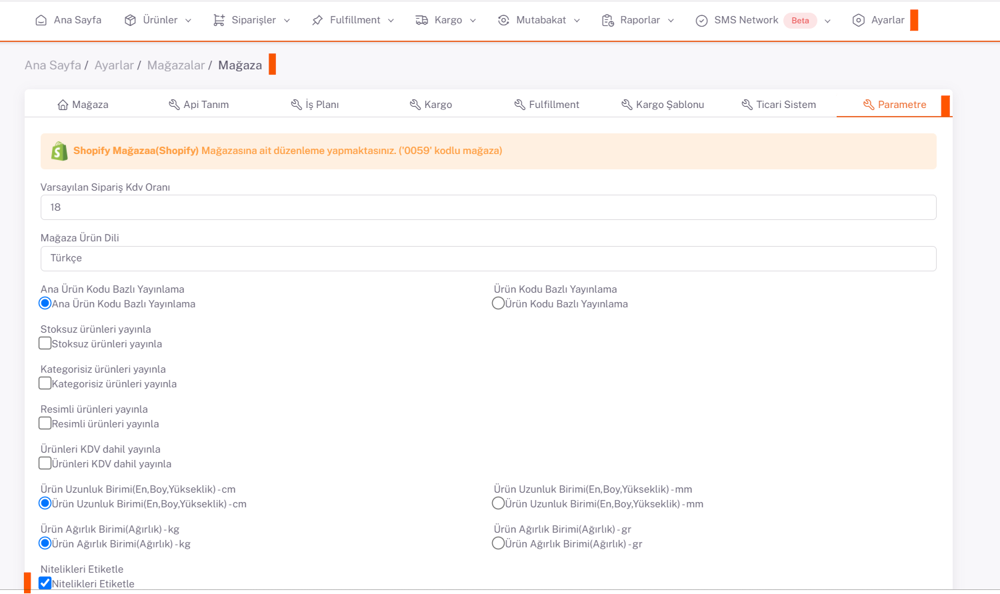
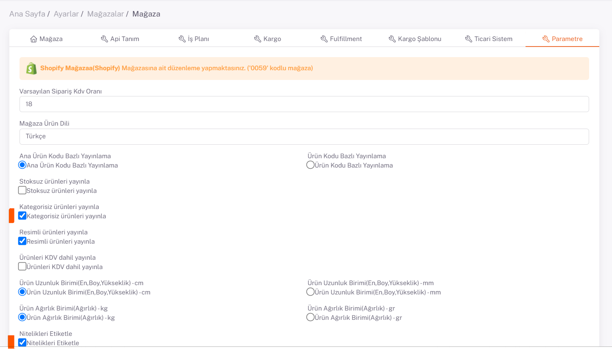
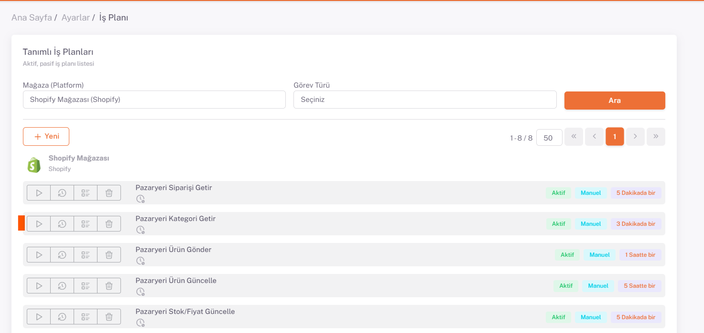

# Shopify Kategori Eşleştirme 

## Shopify Parametreler

**Shopiverse Panel > Ayarlar > Mağazalar > Shopify** içerisinde bulunan mağaza parametreleri ekranın tıklanır.

**Nitelikleri Etiketle** ile Nitelik değerlerinin etiketlenerek platforma gönderilmesi sağlanıyor.

:::caution
Daha Sonra ürünleri platforma **kategori eşleştirme yapmadan, ürün bilgilerinde bulunan etiket** ile gönderilmesi sağlanmalı. Etiketi olmayan ürünler gönderilmemektedir.
:::

Kategorisi yapılarak gönderilmek istenen ürünleri **“platform kategori getir”** *iş planı* çalıştırarak **platformdaki** kategorilerin getirilmesi gerekiyor.

## Kategori Eşleştirme

Platformdan kategoriler çekildikten sonra **Shopiverse Panel > Ürünler > Platform Eşleştirme > Tedarikçi Kategori Eşleştirme** sayfası üzerinde Kategori eşleştirmesi yapılabilir.

**Mağaza** alanından **Shopify** seçilir ve aşağıda satışa açılabilir olarak seçtiğiniz ürünlerinizin kategorileri listelenir.

İlgili kategorinin sağ tarafında bulunan düzenle butonu ile kategori eşleştirme sayfasını açıyoruz. Buradaki Platform Kategori alanını Tedarikçi Kategori alanında yazan kategorinizin karşılığı olanı ya da en yakın olan kategoriyi seçmeniz gerekmektedir. 

Kategori seçildikten sonra aşağıda Ana Ürün Kodu bazında ürünleriniz ve platformun istediği değer alanları listelenir. Ürünlerinizin satışa açılabilmesi için her Ana Ürün Kodu için karşılık gelen değerlerden “**Zorunlu**” olanları mutlaka doldurmanız gerekmektedir. Bu alanları doldurduktan sonra kaydet diyerek kategori eşleştirmelerini tüm kategori ve ürünlerde tamamlıyoruz. 

