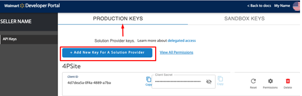
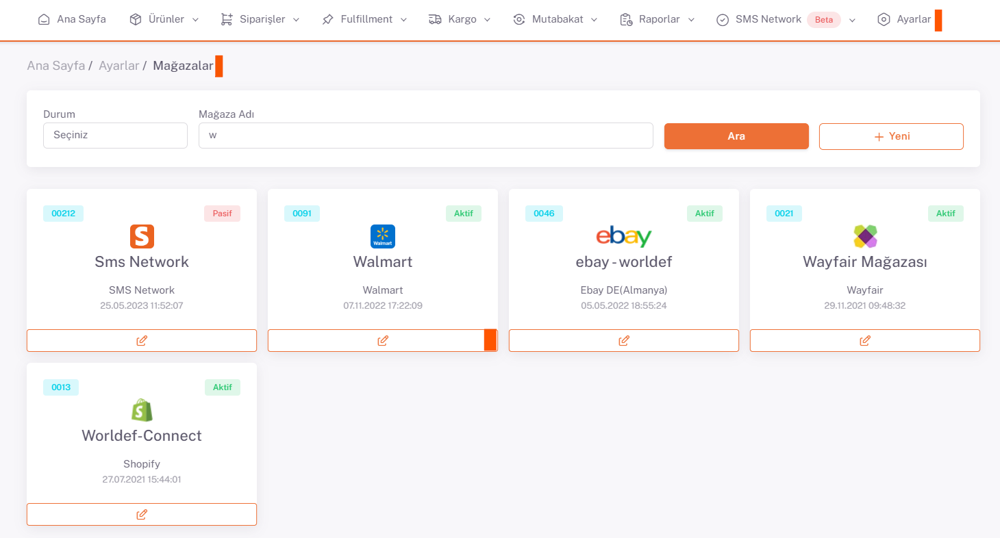

# Wallmart API Entegrasyonu

## Wallmart
https://developer.walmart.com url’sine gidilir.

**My Account** butonu üzerinden giriş yapılır. 

**Production Keys** sekmesinde **Add New Key** butonuna tıklanır.

Açılan ekrandan servis seçimi yapılır. Listelenen servislerden **ShopiVerse** seçilir.

Ekrana gelen tüm yetkiler onaylanarak kaydedilir

## Client ID - Client Secret

Buradan alınan **Client Id ve Client Secret** bilgileri, ShopiVerse mağaza ayarlarında Api Tanım sekmesine kaydedilir.

## Api Tanımı

