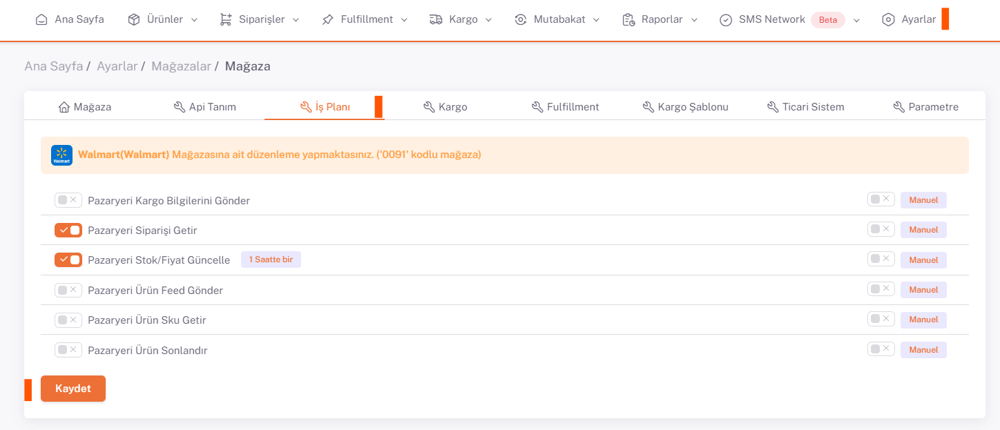
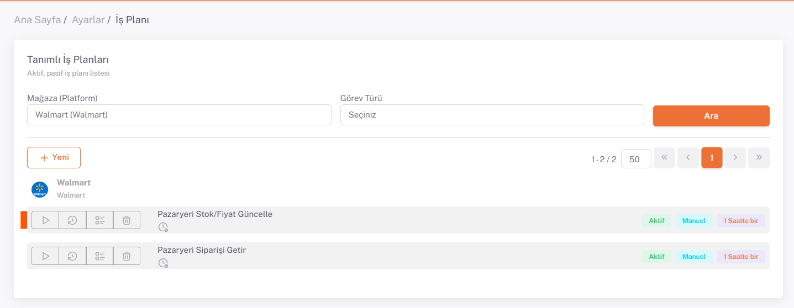

# Wallmart İş Planları 

Shopify için *kategori eşleştirme, varyant eşleştirme, ürün içeriği ve fiyat düzenlemeleri* yapıldıktan sonra **Ayarlar > Mağazalar > Wallmart > İş Planı** sayfasında ***ilgili iş planları***nı *Manuel/Otomatik* olarak belirleyip aktif hale getirmeniz gerekmektedir.

## Ayarlar > İş Planı 

Bu işlemi yaptıktan sonra **Ayarlar > İş Planı** altından Wallmart tab’i altındaki “**Mağazalar Sayfasında aktif edilen ilgili**” iş planı yan üçgen sembolü olan çalıştır butonu ile çalıştırılır.

:::caution

İş planı sayfasında bulunan iş planları mağazalardan aktif edilen iş planlarıdır, aktif edilmemesi durumunda tekrar mağazalardan kontrol ediniz.

:::

