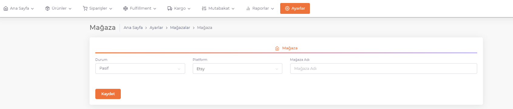

# Yeni Mağaza Ekleme

## Ayarlar

**ShopiVerse** kullanıcı panelinde **Ayarlar > Mağazalar**  içerisinde *Ekle Butonu* ile eklemek istediğimiz mağazanın bilgilerini ekliyoruz.

## Mağaza Ekleme

**Mağaza ekleme paneli**nde bulunan **Mağaza Durumu (Aktif / Pasif)** , **Yayınlamak istediğimiz platform adı ve Mağazamız adı** bölümlerini dolduruyoruz.
Daha sonra **kaydet butonu** ile mağazamızı kaydediyoruz.

 