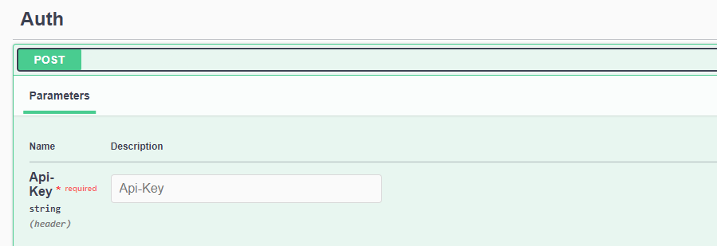
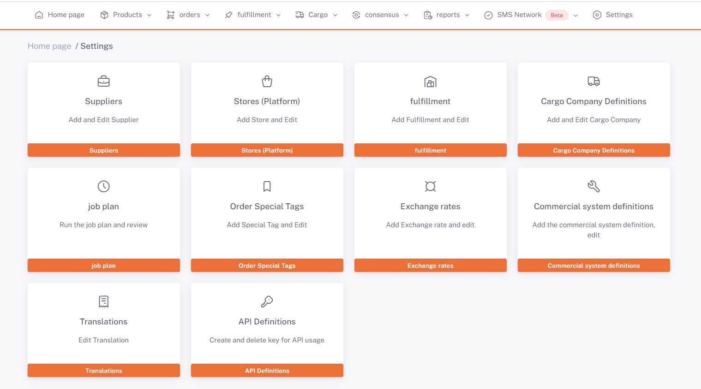

# Receiving Tokens

### Requests


You can access your **Api-Key (Required)** parameter information from the **Home Page > Settings > Api Definitions** section in the Shopiverse panel.



:::note
You can try the **[Auth Api OwnToken](https://api.shopiverse.com/swagger/index.html "Auth Api OwmToken")** method where you can get Tokens by creating the required request via ShopiVerse Api.
:::

### Responses

#### Code 200 Success Response
``json
{
   "data": {
     "token": "string",
     "tokenType": "string",
     "expiration": "2023-05-24T14:15:06.683Z"
   },
   "success": true,
   "message": "string"
}
```

#### Code 400 BadRequest
``json
{
   "success": true,
   "message": "string"
}
```