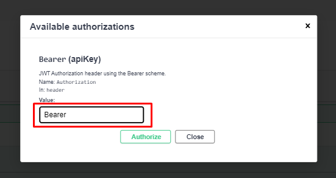
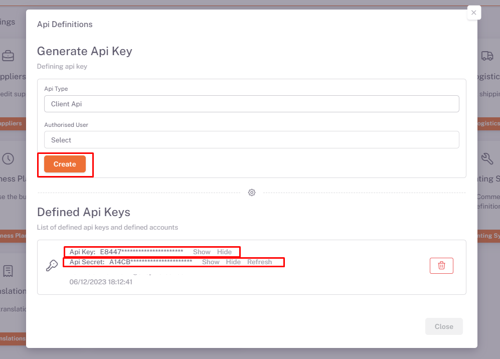

# Token Retrieval

### Request


We enter the **Auth Token** information given by the api into the api authorization.



You can access your **Api-Key (Required)** parameter information from **Home > Settings > Api Definitions** section in the Shopiverse panel. Api Request limit is fixed at **2 requests per minute**.




:::note
You can try the **[Auth Api OwnToken](https://api.shopiverse.com/swagger/index.html "Auth Api OwmToken")** method where you can get a token by creating the necessary request via ShopiVerse Api.
:::

#### Responses

#### Code 200 Success Response
```json
{
  "data": {
    "token": "string",
    "tokenType": "string",
    "expiration": "2023-05-24T14:15:06.683Z"
  },
  "success": true,
  "message": "string"
}
```

#### Code 400 BadRequest
```json
{
  "success": true,
  "message": "string"
}
```