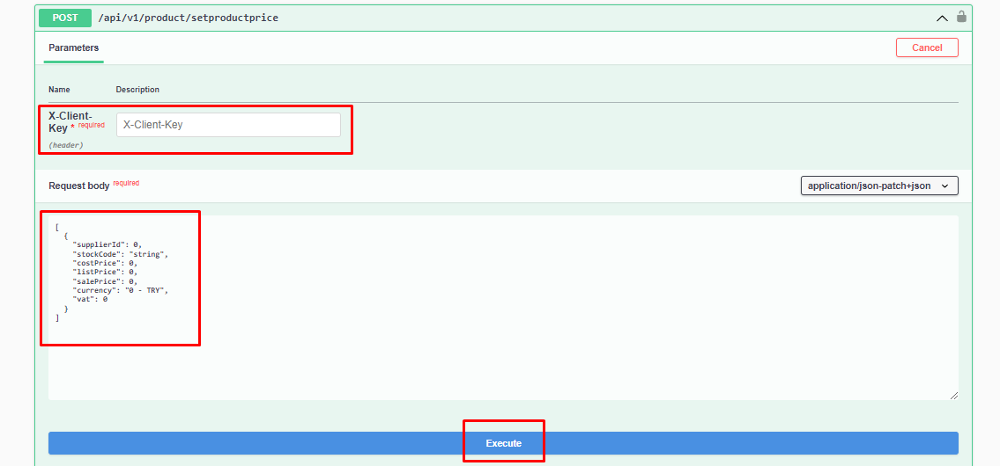

# Adding Product Stock-Price

#### Parameter




:::note
X-Client Key is the API-Key information found in the Api Definitions in the Shopiverse panel.Api Request limit is fixed as **2 requests per minute**.
:::

```json
 [
  {
    "supplierId": 0,
    "stockCode": "string",
    "stock": 0,
    "warehouse": [
      {
        "warehouseId": 0,
        "stock": 0
      }
    ]
  }
]
```

:::note
You can try the **[Product Api SetProductStock](https://api.shopiverse.com/swagger/index.html "Warehouse Api ProductStock")** method by entering the stock price information of the products on Shopiverse via ShopiVerse Api as above and creating the necessary request.
:::

#### Responses

#### Code 200 Success Response
```json
{
  "data": {
    "taskCode": "string"
  },
  "success": true,
  "message": "string"
}
```

#### Code 400 BadRequest
```json
{
  "success": true,
  "message": "string"
}
```
