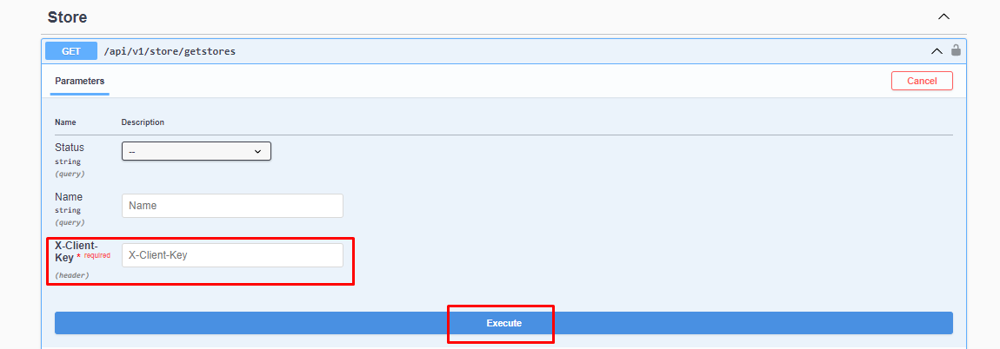

# Bringing Stores

### Request Body

 

```json
{
  "status": 0,
  "name": "string",
  "marketplaceTypes": [
    0
  ]
}
```

:::note
X-Client Key is the API-Key information found in the Api Definitions in the Shopiverse panel. Api Request limit is fixed as **2 requests per minute**.
:::

:::note
In order to attract your stores on Shopiverse, you can try the **[Store Api GetStores](https://api.shopiverse.com/swagger/index.html "Store Api GetStores")** method by entering the necessary information as above and creating the required request. .
:::

### Responses

#### Code 200 Success Response
```json
{
  "data": [
    {
      "id": 0,
      "status": 0,
      "name": "string",
      "marketplaceType": 0
    }
  ],
  "success": true,
  "message": "string"
}
```

#### Code 400 BadRequest
```json
{
  "success": true,
  "message": "string"
}
```
