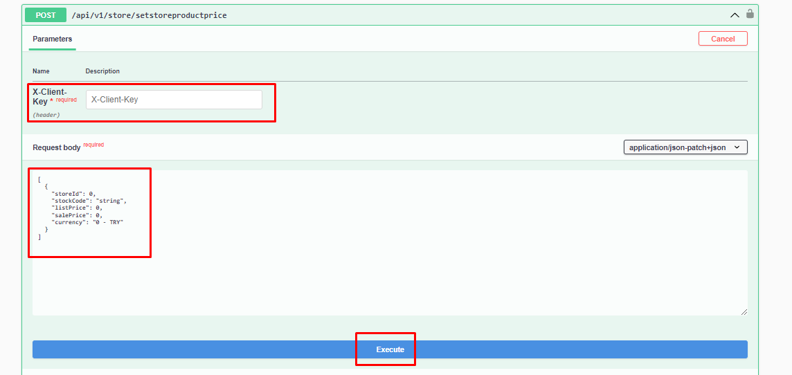

# Send Store Product Price

### Request Body



```json
[
  {
    "storeId": 0,
    "stockCode": "string",
    "listPrice": 0,
    "salePrice": 0,
    "currency": "0 - TRY"
  }
]
```
:::note
X-Client Key is the API-Key information found in the Api Definitions in the Shopiverse panel. Api Request limit is fixed as **2 requests per minute**.
:::

:::note
To pull your stores on Shopiverse, you can try the **[Store Api SetStorProductPrice](https://api.shopiverse.com/swagger/index.html "Store Api SetStoreProductPrice")** method by entering the necessary information as above through the ShopiVerse Api and creating the necessary request. .
:::

### Responses

#### Code 200 Success Response
```json
{
  "data": {
    "taskCode": "string"
  },
  "success": true,
  "message": "string"
}
```

#### Code 400 BadRequest
```json
{
  "success": true,
  "message": "string"
}
```
