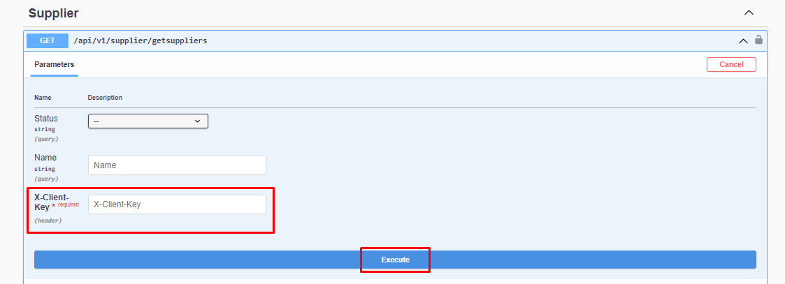

# Get Suppliers

### Parameter


```json
 Status : string Active(1) , Passive(0)
 Name : string
```

:::note
X-Client Key is the API-Key information found in the Api Definitions in the Shopiverse panel. Api Request limit is fixed as **2 requests per minute**.
:::
:::note
To attract suppliers on Shopiverse, you can try the **[Supplier Api GetSupplier](https://api.shopiverse.com/swagger/index.html "Supplier Api GetSuppliers")** method by entering the necessary information through the ShopiVerse Api as above and creating the necessary request. .
:::

### Responses

#### Code 200 Success Response
```json
{
  "data": [
    {
      "id": 0,
      "status": "0 - Pasif",
      "code": "string",
      "name": "string"
    }
  ],
  "success": true,
  "message": "string"
}
```

#### Code 400 BadRequest
```json
{
  "success": true,
  "message": "string"
}
```
