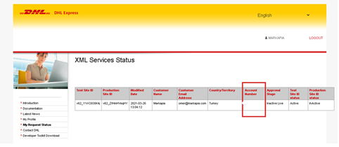
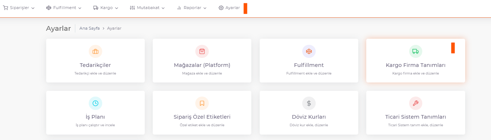
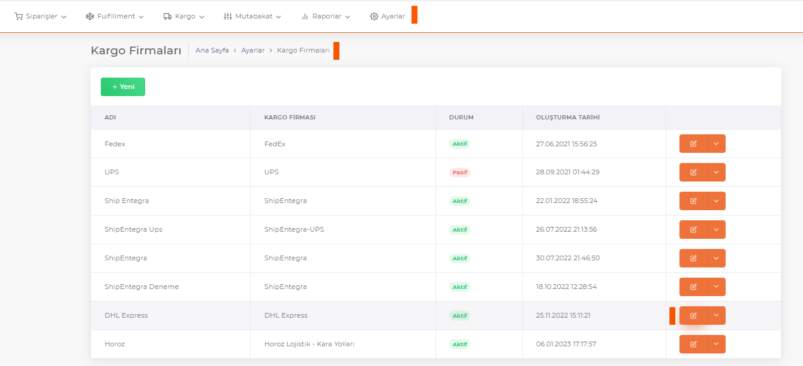
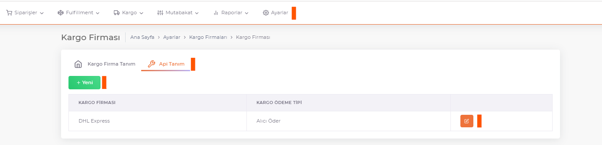
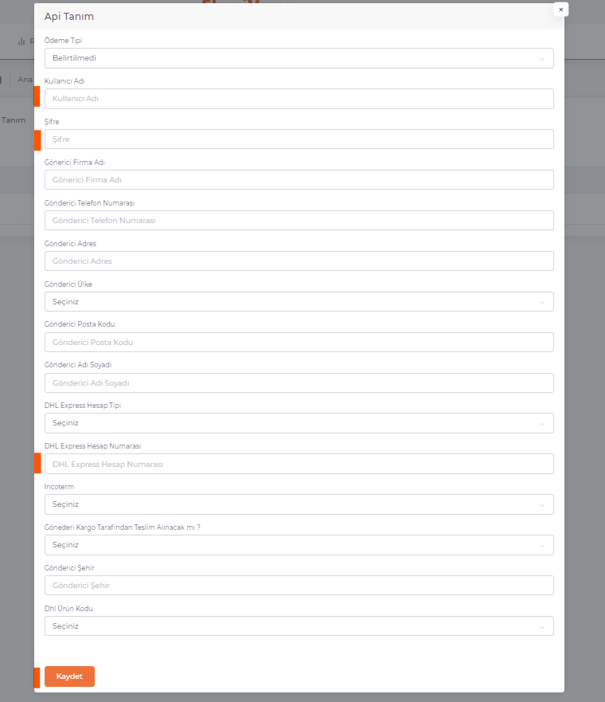

# DHL Integration

## Username Password

**Username and Password** information is given to you by DHL Team as **SiteId and Password**.

**Dhl Account Number** can be accessed via https://xmlportal.dhl.com/userCustomerListing link.

This information and other special information about the sender (name, surname, etc.) are added as a parameter in the **ShopiVerse > Settings > Cargo Company Definitions** settings.

:::caution
If your cargo company is not in the list, you can define it from **[Cargo Company Definitions](/shopiverse/en/docs/dashboard/dashboard-tutorial/settings/commercial-system/)**.
:::

In the panel below, we fill in the user information and **Username, Password, DHL Account Number** that you received from the System and click on the **Save Button**.

 