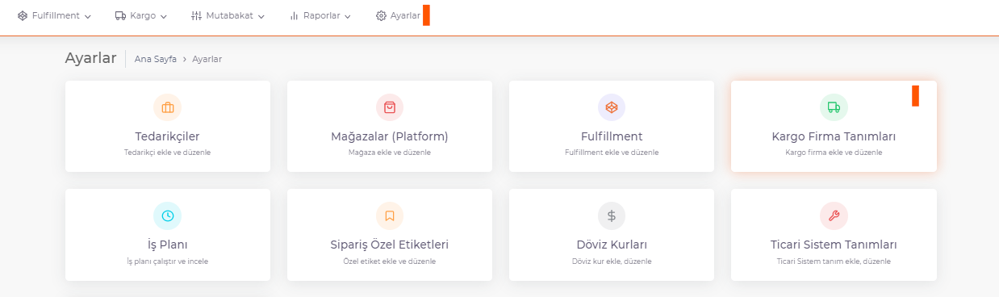
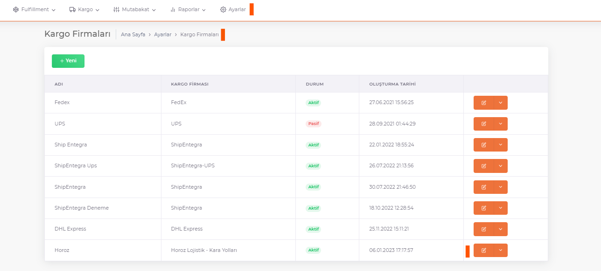
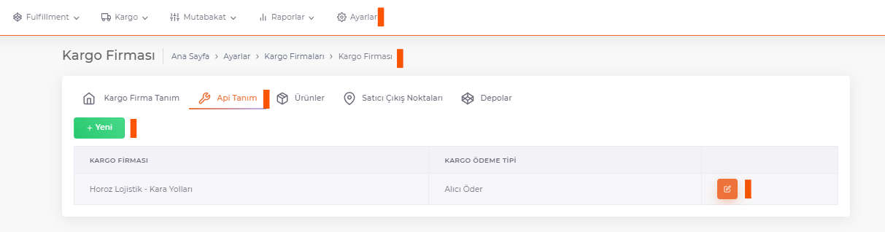
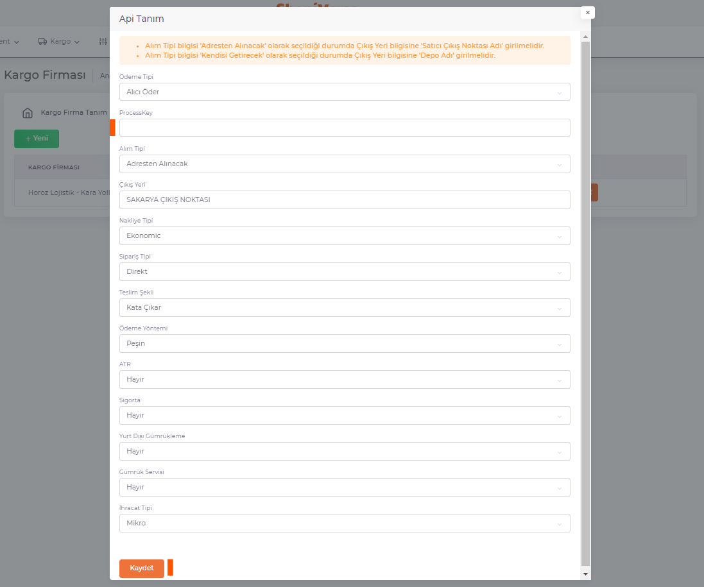

# Horoz Lojistik-Karayolları Entegrasyon

**[Kargo Firma Tanımı Ekle](/docs/dashboard/dashboard-tutorial/settings/cargo)** Sekmesinden Horoz Lojistik - Kara Yolları Kargo tanımı yapılır.

**Shopiverse > Ayarlar > Kargo Firma Tanımları** panelinde **Ekle** veya Kargo Firması eklenmiş ise **Düzenle** butonu ile **Apı Tanımı** seçilir.

:::caution
Listede kargo firmanız bulunmuyorsa **[Kargo Firması Tanımları](/docs/category/kargo-firma-tanımları)**'ndan tanımlayabilirsiniz.
:::

## Api Tanımı > Düzenle

**Horoz Lojistik**’ten alınan **Process Key** bilgisi ShopiVerse paneline parametre olarak tanımlanır. 

**Process Key** ile birlikte diğer bilgilerin de doldurularak kaydedilmesi yeterlidir. 

:::caution
**Sipariş Bildirimi** için gerekli olan diğer tüm parametrelerin de tanımlanması zorunludur (**Alım Tipi, Çıkış Yeri vs**). 
**Alım Tipi** bilgisi '**Adresten Alınacak**' olarak seçildiği durumda **Çıkış Yeri** bilgisine '**Satıcı Çıkış Noktası Adı**' girilmelidir.
**Alım Tipi** bilgisi '**Kendisi Getirecek**' olarak seçildiği durumda **Çıkış Yeri** bilgisine '**Depo Adı**' girilmelidir.
:::
 