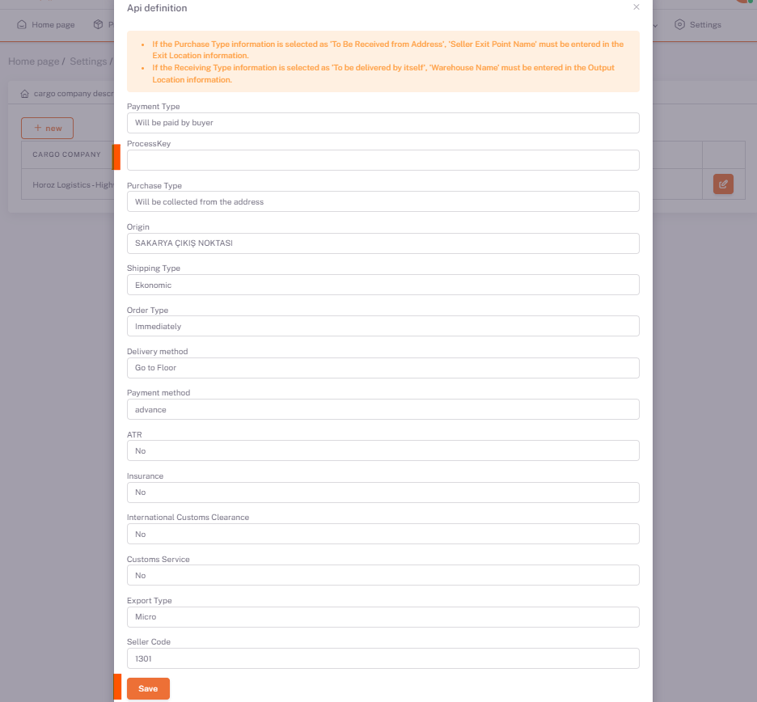

# Horoz Logistics-Highways Integration

**[Add Cargo Company Description](/docs/dashboard/dashboard-tutorial/settings/cargo)** From the Tab, Horoz Lojistik - Kara Yolu Cargo definition is made.

In the **Shopiverse > Settings > Cargo Company Definitions** panel, **Add** or if Cargo Company is added, **API Definition** is selected with the **Edit** button.

:::caution
If your cargo company is not in the list, you can define it from **[Cargo Company Definitions](/docs/category/kargo-firma-tanımları)**.
:::

## Api Definition > Edit

**Process Key** information from **Horoz Logistics** is defined as a parameter to the ShopiVerse panel.

It is sufficient to fill in and save the other information along with the **Process Key**.

:::caution
All other parameters required for **Order Notification** must also be defined (**Receipt Type, Exit Place etc**).
If **Receipt Type** information is selected as '**Receiving From Address**', '**Vendor Exit Point Name**' must be entered in **Exit Location** information.
In case **Pickup Type** information is selected as '**Fully Bring**', '**Warehouse Name**' must be entered in the **Exit Location** information.
:::