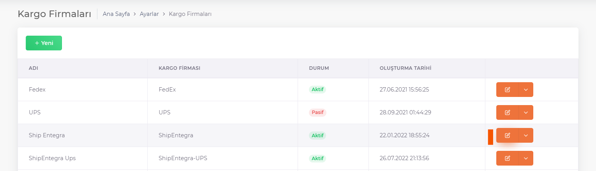
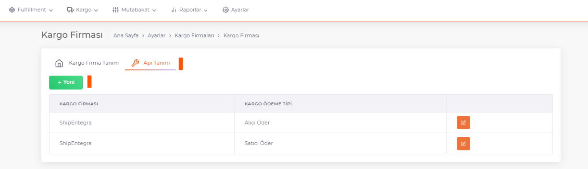
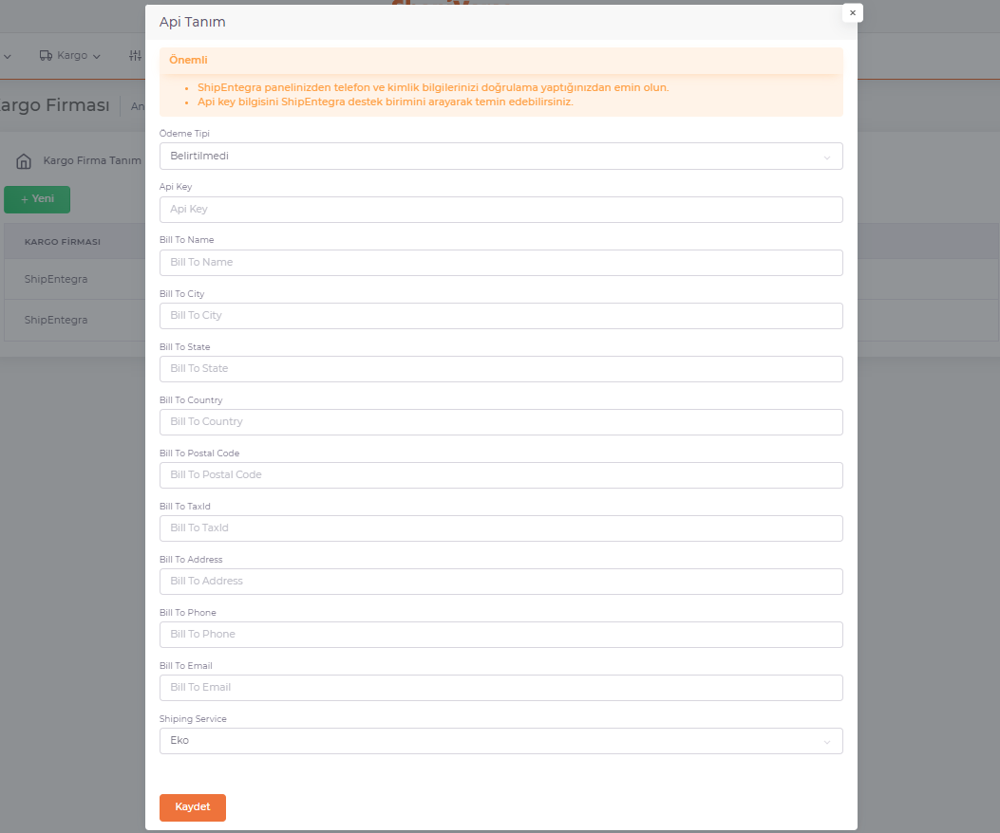

# ShipIntegration Integration

For ***ShipEntegra*** integration, *ShipEntegra* arrangement is selected on the **ShopiVerse Panel > Settings > Shipping Company Definitions** Screen.

:::caution
If your cargo company is not in the list, you can define it from **[Cargo Company Definitions](/shopiverse/en/docs/dashboard/dashboard-tutorial/settings/commercial-system/)**.
:::

In the API Definition tab, the information that will provide the integration of the shipping company and ShopiVerse is defined.

On the screen opened by pressing the **"New"**or **"Edit"** button, the Payment Type information, which determines who will make the cargo payments (buyer or seller), is selected.

**Api Key** information received from ShipEntegra is defined.

Other information required for the invoice is filled in and saved.

:::caution
Make sure to **Verify your Phone and ID** from your ShipEntegra panel.
**Api key** information can be obtained by calling **ShipEntegra support unit**.
:::

