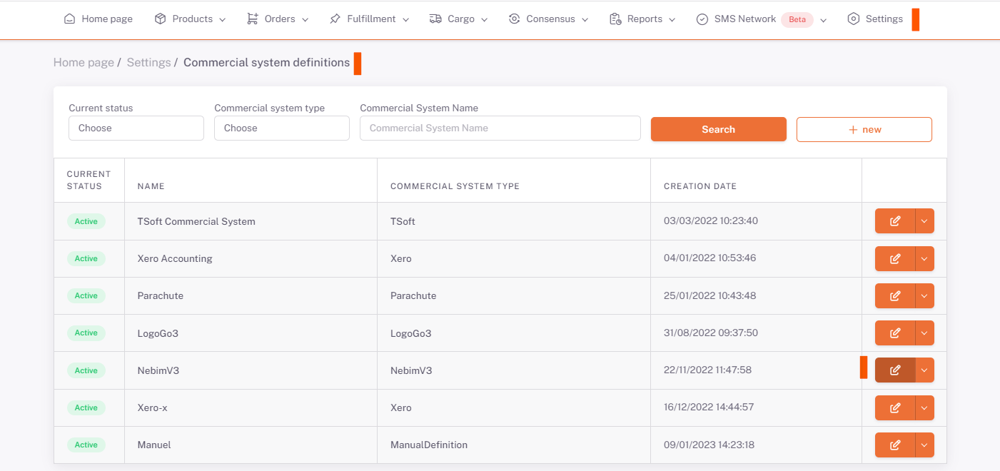
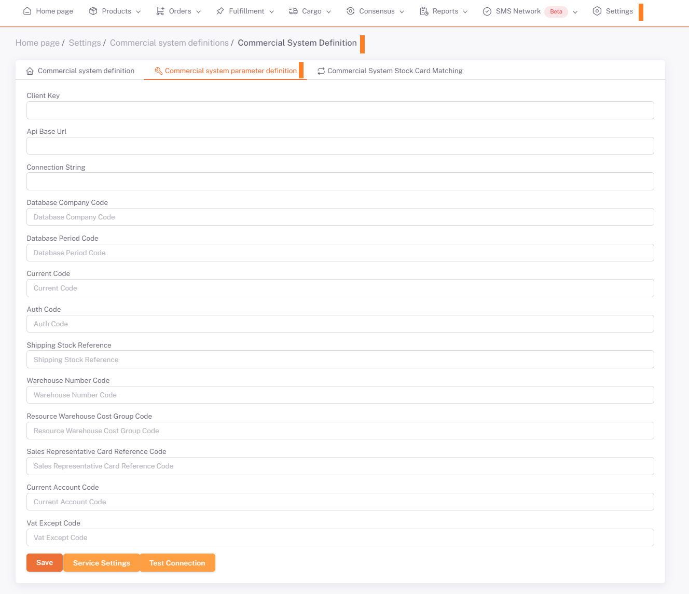

# LogoGo3 Integration

You can list the registered Commercial Systems by going to the **ShopiVerse Panel > Settings > Commercial Systems** Screen.

:::caution
If your **Commercial System** is not listed, you can define a new Commercial System from **[Commercial System Definitions](/docs/dashboard/dashboard-tutorial/settings/commercial-system/)**.
:::

With the **Edit** button, you can fill in the required information from the ***LogoGo3*** application and save it in the **Commercial System Parameter Definition** tab.

