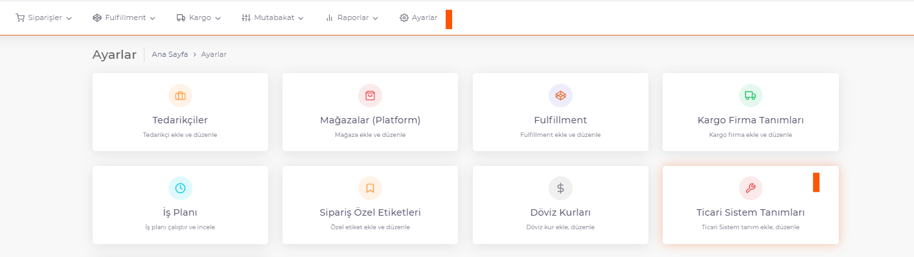
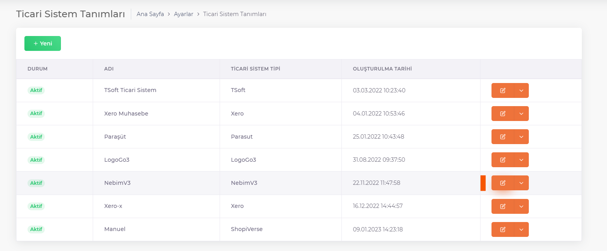
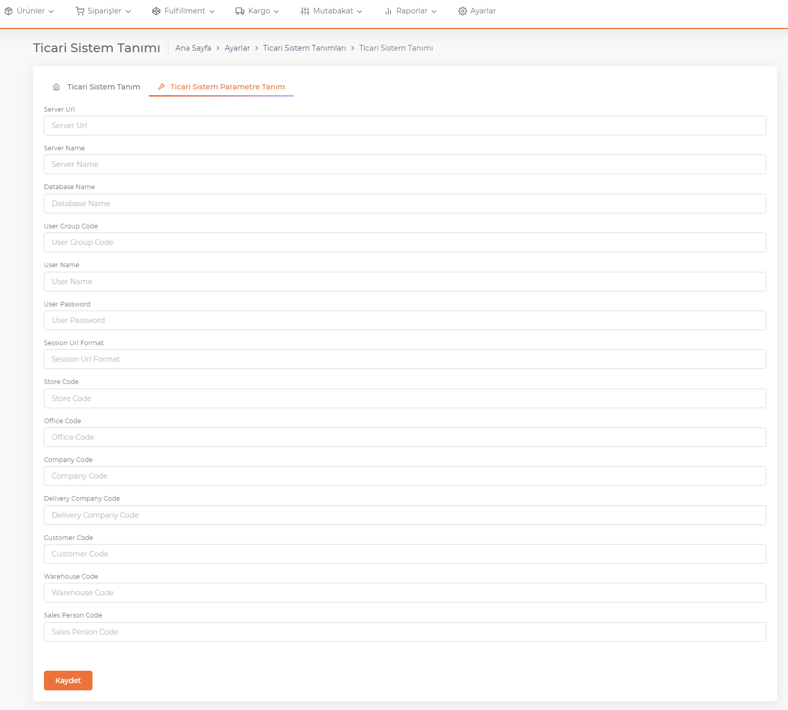

# NebimV3 Integration

You can list the registered Commercial Systems by going to the **ShopiVerse Panel > Settings > Commercial Systems** Screen.

:::caution
If your **Commercial System** is not listed, you can define a new Commercial System from **[Commercial System Definitions](/shopiverse/en/docs/category/ticari-sistem-tanımları)**.
:::

With the **Edit** button, you can fill in the required information from ***NebimW3 Authorities*** and save it in the **Commercial System Parameter Definition** tab.

