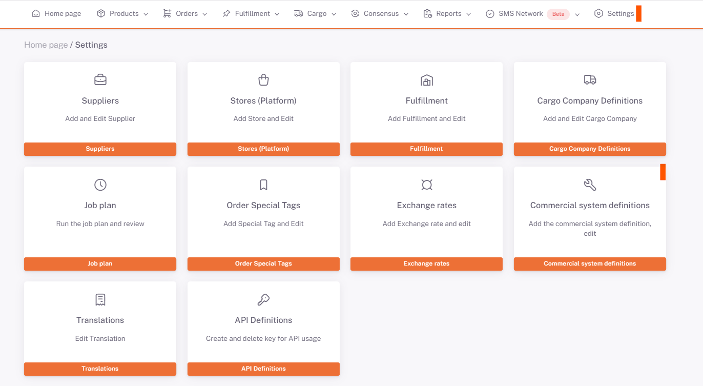

# Parachute Integration

## Company Info

In the **Parachut** panel, the **Settings> Company Information** screen is accessed.

When you are on the company information screen, the number displayed in the **url** address is the company code.

:::caution
If your **Commercial System** is not listed, you can define a new Commercial System from **[Commercial System Definitions](/docs/dashboard/dashboard-tutorial/settings/commercial-system/)**.
:::

The number obtained from the URL is saved in the **Company Code** field in the **ShopiVerse > Settings > Commercial System Definition** *Commercial System Parameter Definition* tab.

There is no need to fill in the **Vault Code** field in the ShopiVerse panel. **Fixed Customer Code**, **Category Code** and **Label** fields are not required.

By clicking the "**Request Authorization**" button, you can enter the page with the Parachute information. If the "**Authorization request has been confirmed**" warning is given, the transaction is completed.