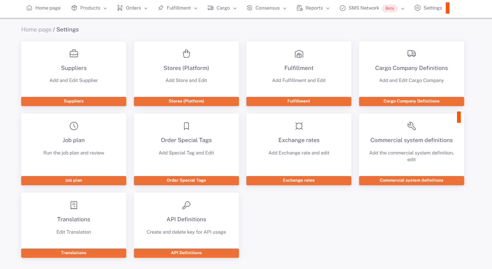

# T-Soft Entegrasyon

**Kullanıcı Adı ve Şifre** bilgileri, **ShopiVerse > Ayarlar > Ticari Sistem Tanımları**nda **Ticari Sistem Parametre Tanım** sekmesine kaydedilir. 

## Ticari Sistem > Düzenle

:::caution
Listede **Ticari Sisteminiz** bulunmuyorsa yeni Ticari Sistem tanımlamayı **[Ticari Sistem Tanımları](/docs/dashboard/dashboard-tutorial/settings/commercial-system/)**'ndan yapabilirsiniz.
:::

## Ticari Sistem Tanımı

:::caution

Kullanıcı Adı ve Şifre bilgileri **T-Soft paneline giriş** yapılırken kullanılan bilgilerdir.

:::

 