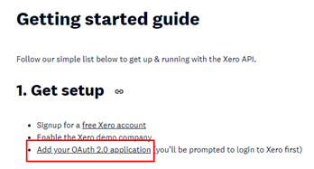
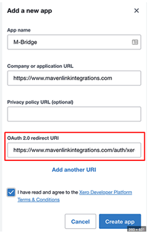
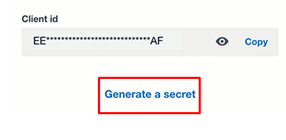
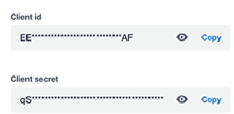
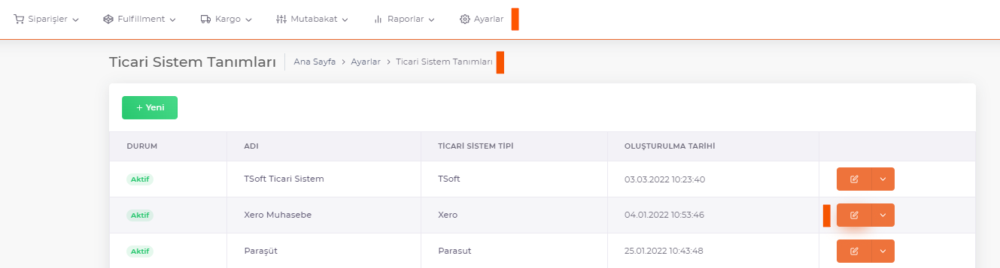
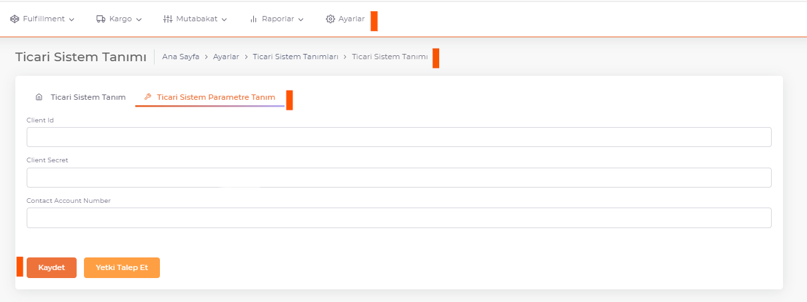

# Xero Integration

## Client ID - Client Secret

https://developer.xero.com/documentation/getting-started-guide/ (There is detailed information about the integration steps on this link.)

Client Id and Client Secret information are requested from the screen opened by clicking the **Add your application** link.

Fill the form and click the **Create App** button.

**App Name** : *ShopiVerse* , **Company Url** : *https://app.shopiverse.tech*  ,  **Redirect Url**: *https://app.shopiverse.tech/tr/settings/commercialsystem/xeroaccept* 

Such a screen is displayed after registration.

Detail information is displayed by pressing the **Generate a Secret** button.

## Commercial System Definitions

**Client Id and Client Secret** information copied from here is saved in **ShopiVerse > Settings > Commercial System Settings > Parameter Definition** tab.

:::caution
If your **Commercial System** is not listed, you can define a new Commercial System from **[Commercial System Definitions](/shopiverse/en/docs/category/ticari-sistem-tanımları)**.
:::

Then log in to the Xero panel again. You can access the account details via the **Accounting** button.

The value in the **Account Number** field in the account details is copied and saved in the **ShopiVerse parameters**.

:::caution
If the **Account Number** information on the Xero panel is empty, it should be filled and registered.
:::

