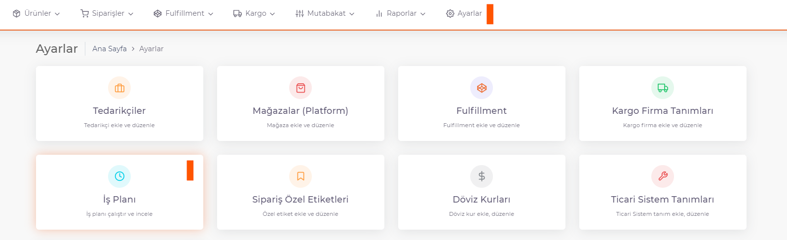
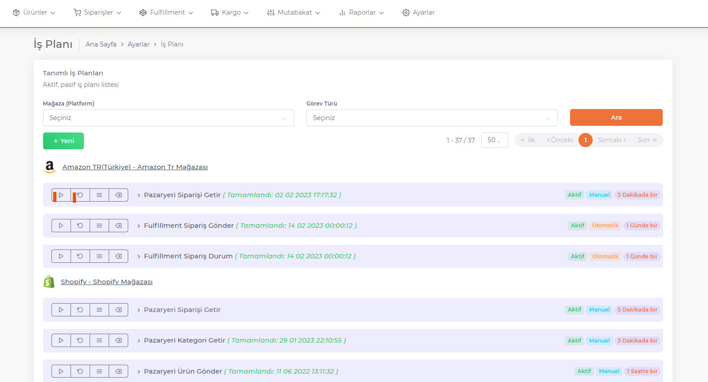

# Job plan

**Business plans** are *tasks* that must be triggered to keep data flowing between the ShopiVerse panel and platforms.

To view the business plans, go to the **ShopiVerse Panel > Settings > Business Plan** screen.

All **business plans with details** appear here. Under each platform, the business plans required for the platform are listed.

(Business plans are set as **Active-Passive** and **Auto-Manual** from the **ShopiVerse Panel > Settings > Stores > Business Plan Settings** screen.)

Press the "**Run**" button to run the work plan.

To access the details of the work plan, the "**Business Plan History**" button is pressed. Here, information is given about errors, warnings, and actions to be taken while the business plan is running. 