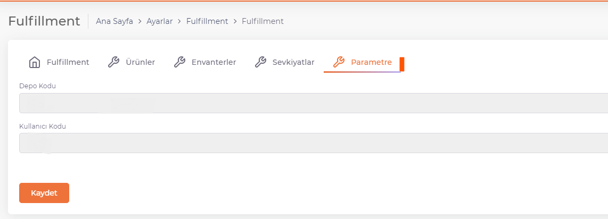
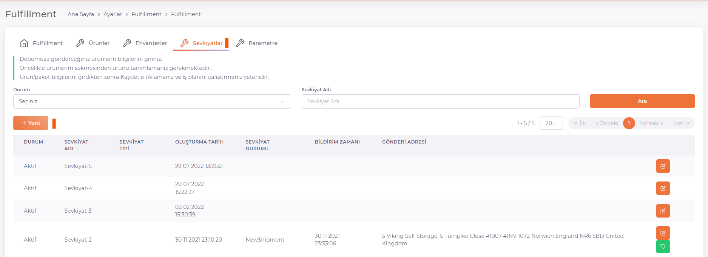
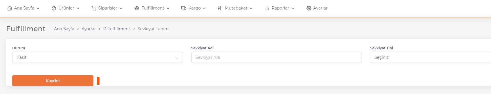
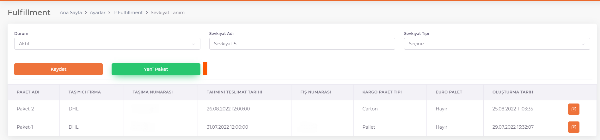
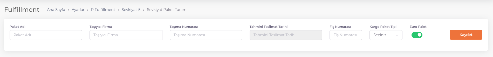
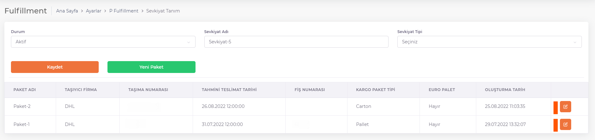
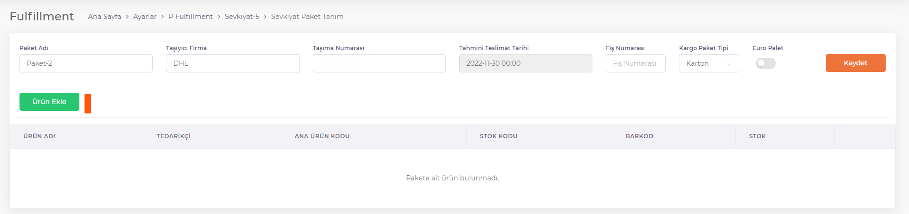
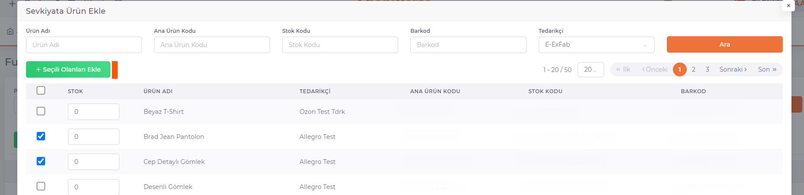

# Fulfillment Sevkiyat

## Parametre 

**Kullanıcı Kodu ve Depo Kodu** bilgilerinin bulunduğu sekmedir.

 

Bu bilgilerin tanımlamaları ShopiVerse tarafından yapılır. 

## Sevkiyatlar 

*Ürün gönderimleri* tamamlandıktan sonra, ürünlerin fiziksel olarak gönderimi olan sevkiyat işlemleri yapılır.

 

"Yeni" butonuna basılır ve açılan ekranda Durum ve Sevkiyat Adı tanımlanarak kaydedilir. 

 

### Paket Tanımı

Sevkiyat kaydedildikten sonra sevkiyat içerisine paketler tanımlanır. 

 

"Yeni Paket" butonuna basılır. 

**Paket adı** alanına oluşturulan pakete verilen isim tanımlanır. 

**Taşıyıcı Firma** alanına kullanılmak istenen kargo firmasının ismi tanımlanır. 

**Taşıma Numarası, Tahmini Teslimat Tarihi, Fiş Numarası bilgileri** tanımlanır ve **Kargo Paket Tipi** seçilerek kaydedilir. 

### Ürün Ekleme

Daha sonra oluşturulan **paket detayın**a girilerek paket içerisine ürünler eklenir. 

"**Ürün Ekle**" butonuna basılır. 

Pakete eklenmek istenen ürünler seçilir, her bir ürün için gönderilecek stok değeri girilir ve "**Seçili Olanları Ekle**" butonuna basılarak işlem tamamlanır.

Sevkiyat içerisine ürünlerin eklenmesi tamamlanmıştır.  

**Sevkiyatın depoya bildirilmesi** için iş planlarının çalıştırılması gereklidir. 

**ShopiVerse Panel > Ayarlar > İş Planı** ekranından "**Depo Sevkiyat Bildir**" iş planı çalıştırılır. 
İş planı "**Tamamlandı**" durumuna geçtiğinde depoya gönderimler tamamlanmıştır, artık fiziksel olarak ürün gönderimleri yapılabilir durumdadır. 

Fiziksel olarak sevkiyat gönderimi yapıldıktan sonra sevkiyatın durumu kontrol edilmek istenirse, öncelikle **ShopiVerse Panel > Ayarlar > İş Planı** ekranından "**Depo Sevkiyat Durum**" iş planı çalıştırılır. 

:::caution
İş planı tamamlandığında Sevkiyat sekmesinde Sevkiyat Durumu kontrol edilmelidir. 
:::