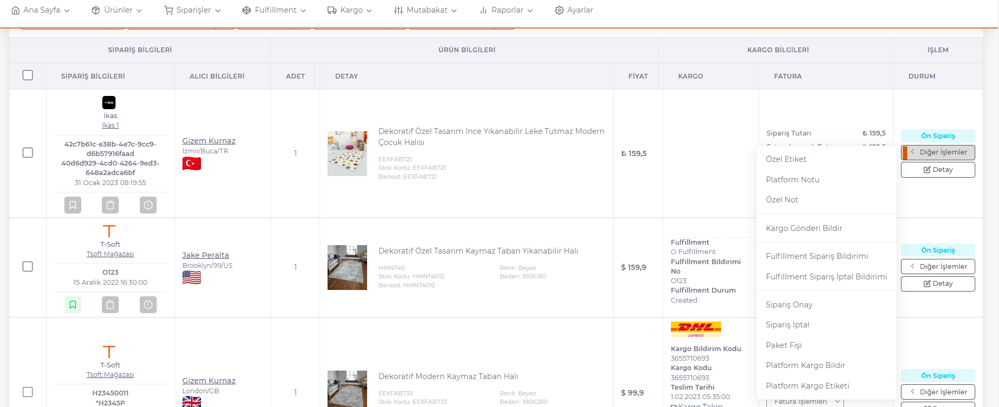

# Siparişler

Sipariş özelinde yapılan işlemler vardır.

**Diğer İşlemler** butonuna basılarak seçenekler açılır. 

Siparişe *özel etiket* eklemek için, **Özel Etiket** butonuna basılarak açılan ekranda daha önce tanımı yapılan etiketlerden seçilerek kaydedilir. 

Siparişe *platform notu* eklemek için, **Platform Notu** butonuna basılarak açılan ekranda Platform Notu alanı doldurularak kaydedilir. 

Siparişe *özel not* eklemek için, **Özel Not** butonuna basılarak açılan ekranda Özel Not alanı doldurularak kaydedilir. 

Siparişin *kargoya bildirimini* yapmak için, **Kargo Gönderi Bildir** butonuna basılarak açılan ekranda gerekli alanlar doldurulur. 

Sipariş *alıcının kendisine veya bir fulfillmenta* gönderilebilir.  

Siparişin **gönderim yeri** seçilerek kaydedilir.  

 

Siparişi *onaylamak* için **Sipariş Onay** butonuna basılır. 

Siparişi *iptal* etmek için **Sipariş İptal** butonuna basılır. 

Platformdan gelen *paket fişini indirmek* için **Paket Fişi** butonuna basılır. 

Kargo platform anlaşmasıyla gittiği durumda, *siparişi platforma bildirmek* için **Platform Kargo Bildir** butonuna basılır. 

Platforma kargo bildirimi yapıldıktan sonra platformdan gelen kargo etiketini *indirmek* için **Platform Kargo Etiketi** butonuna basılır.