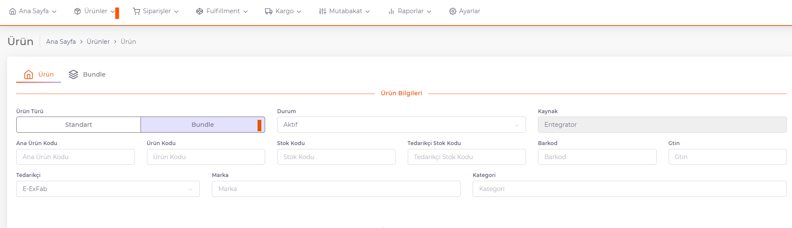
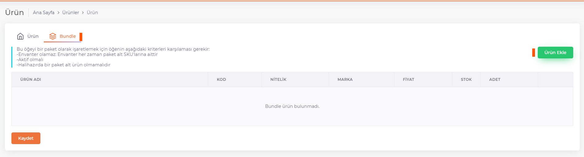
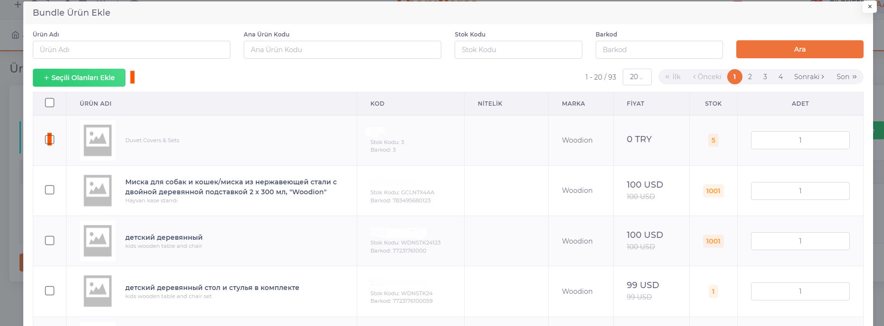

# Panel Üzerinden Ürün Yükleme 

## Bundle Ürün Ekleme

**ShopiVerse Panel > Ürünler > Yeni Ürün** butonuna basılarak açılan ekranda ürün bilgileri doldurularak kaydedilir. 

**Standart** veya **Bundle** ürün eklenebilir. Bundle Ürün tanımı yapmak için, Ürün Türü “**Bundle**” olarak seçilir. 

Ürün bilgileri doldurulur. **Tedarikçi Adı, Ana Ürün Kodu, Stok Kodu, Barkod, Marka ve Kategori alanları** zorunlu alanlardır ve kesinlikle doldurulması gereklidir. 

- **Ana Ürün Kodu**, ürüne ait grup kodudur. 

- **Ürün Kodu**, renk bazlı grup kodudur. 

- **Stok Kodu**, ürüne ait stok kodu bilgisidir. Tekil olmalıdır. 

- **Barkod**, ürüne ait barkod bilgisidir. Tekil olmalıdır. 

- **Tedarikçi Stok Kodu**, tedarikçiye ait tekil koddur. 

- *Tedarikçi Adı* alanında, **Ayarlar > Tedarikçiler** ekranından tanımı yapılan tedarikçiler listelenir. Kullanılmak istenen tedarikçi seçilir.   

- **Marka**, ürüne ait marka bilgisidir. 

- **Kategori**, ürünün kategori kırılımıdır. 

- Ürün Adı, Kısa Açıklama, Açıklama, Bakım ve Kullanım Bilgisi, Etiket alanları dil bazlı tanımlanabilir.  

- Birden fazla etiket eklenmek istediği durumda virgülle ayırarak tanımlanmalıdır. 

- Ürünün renk ve beden nitelik bilgisi tanımlanır. 

- Ürünün fiyat detayları, para birimi ve stok miktarı tanımlanır. 

- Ürüne ve pakete ait ölçü bilgileri tanımlanır. 

- Ürüne ait resimler dosya veya resim yolu olarak tanımlanabilir. 

- Resme ait video varsa video yolu olarak tanımlanabilir. 

- “**Kaydet**” butonuna basılarak ürün kaydedilir. 

**Bundle** içerisine ürün eklemek için “***Bundle***” sekmesi açılır. 

:::caution
“**Ürün Ekle**” butonuna basılarak açılan ekranda bundle içine eklenebilir durumda olan ürünler listelenir. Bu ürünler standart ürünlerdir. Bundle içerisine başka bir bundle ürün eklenemez. 
:::

Bundle içine eklenmek istenilen ürünler seçilir, her alt ürün için bundle içine eklenmek istenilen adet sayısı Adet alanına tanımlanır. 

“**Seçili Olanları Ekle**” butonuna basılarak ürünler eklenir. 

**Bundle içinden çıkarılmak** istenen ürünler **Sil** butonuna basılarak silinebilir. 

Bundle içine eklenen ürünler seçildikten sonra “**Kaydet**” butonuna basılarak bundle ürün tanımlaması tamamlanır. 

