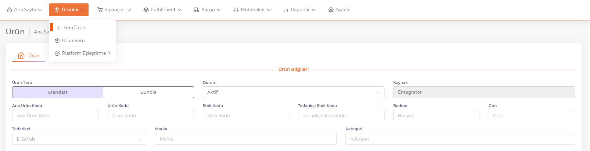

# Ürün Ekleme

## Kaynak Yoluyla Ürün Yükleme 

**ShopiVerse Panel > Ayarlar > [Tedarikçiler](/docs/dashboard/dashboard-tutorial/settings/suppliers/new-supplier)** ekranından tedarikçi tanımı yapılır. 

Tedarikçi tanımlama tamamlandıktan sonra ürünlerin ShopiVerse'e aktarılması için iş planının çalıştırılması gereklidir. 

**ShopiVerse Panel >Ayarlar > İş Planı** sayfasındaki "*Tedarikçi Ürün Aktar*" iş planı çalıştırılır.

İş planı tamamlandığında ürünlerin içeri aktarımı bitmiştir. 

## Panel Üzerinden Ürün Yükleme 

### Standart Ürün Ekleme

**ShopiVerse Panel > Ürünler > Yeni Ürün** butonuna basılarak açılan ekranda ürün bilgileri doldurularak kaydedilir. 

**Standart** veya **Bundle** ürün eklenebilir. Standart Ürün tanımı yapmak için, Ürün Türü “**Standart**” olarak seçilir. 

Ürün bilgileri doldurulur. **Tedarikçi Adı, Ana Ürün Kodu, Stok Kodu, Barkod, Marka ve Kategori alanları** zorunlu alanlardır ve kesinlikle doldurulması gereklidir. 

- **Ana Ürün Kodu**, ürüne ait grup kodudur. 

- **Ürün Kodu**, renk bazlı grup kodudur. 

- **Stok Kodu**, ürüne ait stok kodu bilgisidir. Tekil olmalıdır. 

- **Barkod**, ürüne ait barkod bilgisidir. Tekil olmalıdır. 

- **Tedarikçi Stok Kodu**, tedarikçiye ait tekil koddur. 

- *Tedarikçi Adı* alanında, **Ayarlar > Tedarikçiler** ekranından tanımı yapılan tedarikçiler listelenir. Kullanılmak istenen tedarikçi seçilir.   

- **Marka**, ürüne ait marka bilgisidir. 

- **Kategori**, ürünün kategori kırılımıdır. 

- Ürün Adı, Kısa Açıklama, Açıklama, Bakım ve Kullanım Bilgisi, Etiket alanları dil bazlı tanımlanabilir.  

- Birden fazla etiket eklenmek istediği durumda virgülle ayırarak tanımlanmalıdır. 

- Ürünün renk ve beden nitelik bilgisi tanımlanır. 

- Ürünün fiyat detayları, para birimi ve stok miktarı tanımlanır. 

- Ürüne ve pakete ait ölçü bilgileri tanımlanır. 

- Ürüne ait resimler dosya veya resim yolu olarak tanımlanabilir. 

- Resme ait video varsa video yolu olarak tanımlanabilir. 

- “**Kaydet**” butonuna basılarak ürün kaydedilir. 

