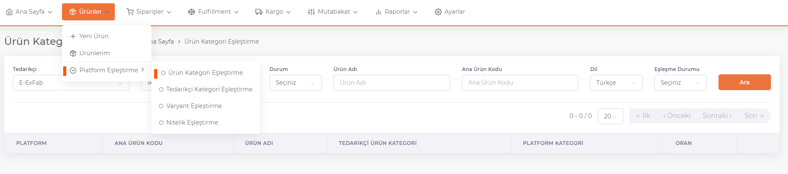
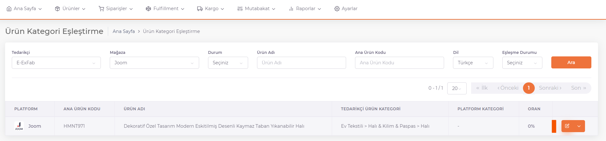
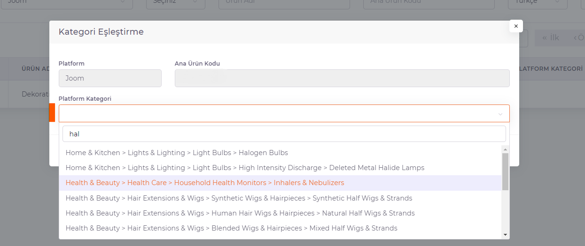

# Ürün Kategori Eşleştirme

**ShopiVerse Panel > Ürünler > Platform Eşleştirme> Ürün Kategori Eşleştirme** ekranlarına gidilir. 

Kategori eşleştirmesi yapılmak istenen her ürün için **detayına** girilip eşleştirme işlemlerinin yapılması gerekmektedir. 

**Detay** butonuna basılarak açılan ekranda "**Platform Kategori**" alanından eşleştirilmek istenen **platform kategori**si seçilir. 

Doldurulması gereken özellik alanları varsa doldurulur ve kaydedilir. 

Ürünün kategori eşleştirmesi tamamlanmıştır. 
 
:::caution
Ürün için daha önce **Tedarikçi Kategori Eşleştirme** yapılmış ise artık geçersiz sayılacaktır ve **Ürün Kategori Eşleştirme** işlemindeki **kategori baz alınacaktır**. 
:::