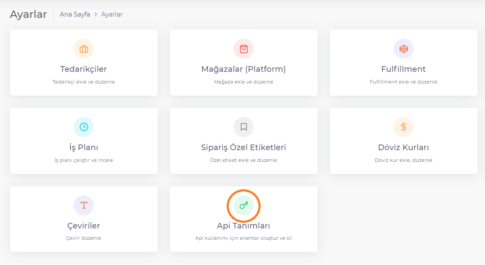

# API Tanımları

*Shopiverse Panel* üzerindeki verilerin *Api* ile çekilebilmesi için **Shopiverse Panel > Ayarlar > Api Tanımları** sekmesi üzerinden **Api Tipi ve Yetkili Kullanıcı** belirleyip **Api Key** oluşturarak Api izinlerini sağlayabilirsiniz. 
**[API sayfamız](/docs/api/api.md)** üzerinden izinler ve testler hakkında bilgi alabilirsiniz.

