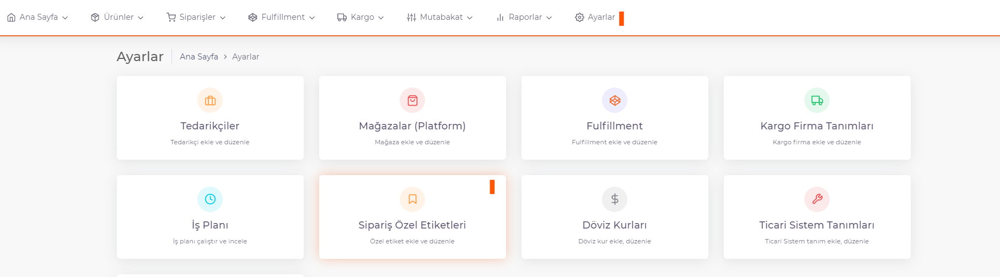
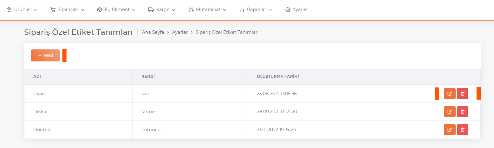

# Sipariş Özel Etiket

**Özel etiketler**, siparişler hakkında bilgi vermek amacıyla tanımlanan etiketlerdir. 

*Yeni bir sipariş özel etiket tanımı* yapmak için **ShopiVerse Panel > Ayarlar > Sipariş Özel Etiket Tanımları** ekranlarına gidilerek "**Yeni**" butonuna basılır. 

Açılan ekranda **Adı** alanına *etikete verilmek istenen isim*, **Renk** alanına *etikete verilmek istenen renk* tanımlanır.  

*Açıklama* alanı da doldurularak kaydedilir. 
