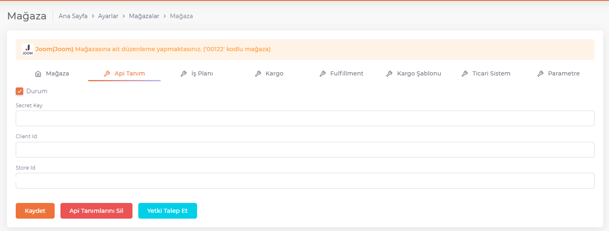
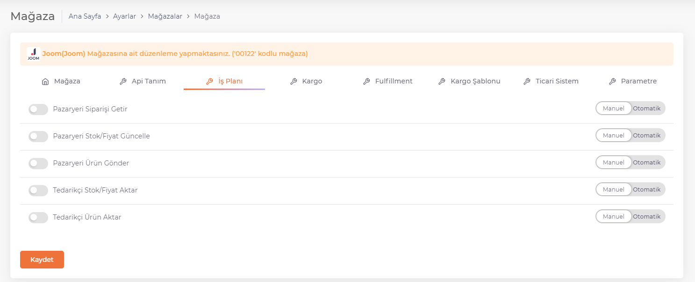
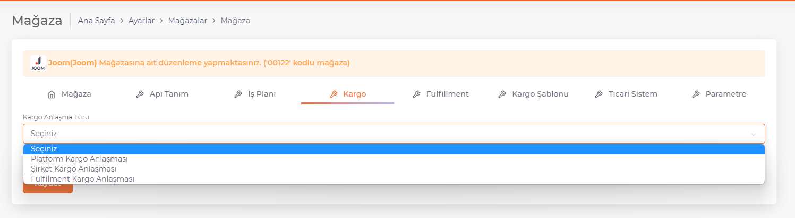

# Panel Tanıtım

## Api Tanımı

[Pazaryerlerinde API Entegrasyonları](/docs/category/pazaryerleri)'nda pazaryeri API tanımları yapılır. Ve gerekli yerler doldurulur. ShopiVerse paneli ile mağazaları birbirine bağlayacak olan tanımlamalar buradan yapılmaktadır.

## İş Planı

[İş PlanLarın](/docs/dashboard/dashboard-tutorial/settings/business-plan/)'nda yapılacak işler **Aktif/Pasif** ve **Manuel/Otomatik** olarak ayarlanır ve mağazada iş planları listelenir. İş planları, ShopiVerse paneli ve platformlar arasındaki veri akışını sağlamak için tetiklenmesi gereken görevlerdir.
Bu sekmede ilgili mağaza için tanımlanan iş planları bulunmaktadır.

:::caution
Manuel olarak ayarlandığı durumda iş planının çalışması için özel olarak tetiklenmesi gerekmektedir. 
Otomatik olarak ayarlandığı durumda belirli süre aralıklarıyla iş planı otomatik olarak çalışır. 
:::

## Kargo

Mağazaya özel kargo tanımı buradan yapılmaktadır.  
Kargo anlaşma türü seçilerek kaydedilir. 

