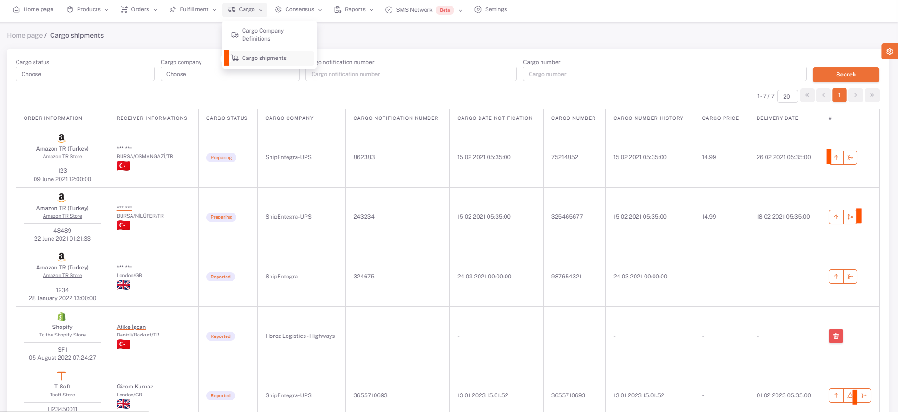

# Cargo

## Cargo Shipments

When a cargo notification is made for the order on the **Orders** screen, this order drops to the **ShopiVerse Panel > Cargo Shipments** screen.

Cargo shipments are listed here with all their details.

The status of the cargo can be tracked here.

If there is movement information of the cargo shipment, it can be viewed on the screen opened by pressing the "**Cargo Movements**" button.

If there is label information for the cargo shipment, the cargo label can be downloaded by clicking the “**Cargo Label**” button.