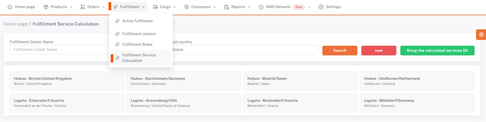
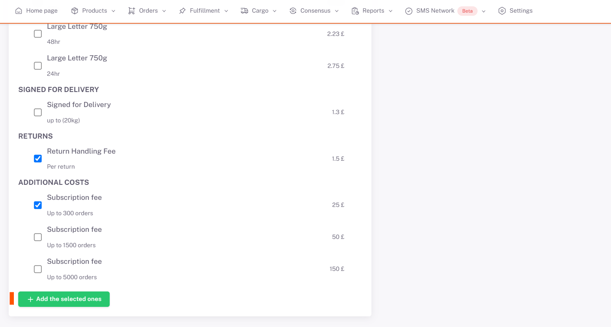
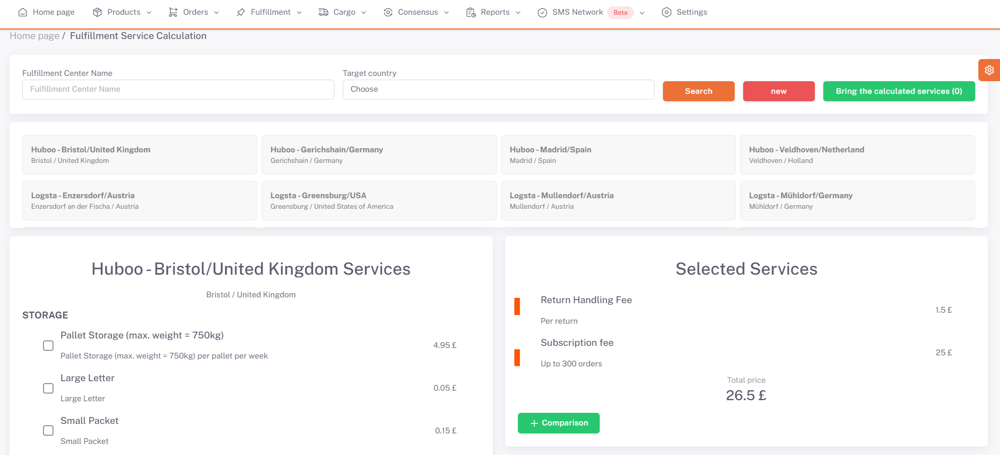

# Fulfillment Service Calculation

On the **ShopiVerse Panel > Fulfillment > Fulfillment Service Calculation** screen, the price of the fulfillment services is calculated and the price values ​​of more than one fulfillment can be compared.

First of all, the fulfillment for which **service calculation** is desired is selected.

After the selection is made, the services of the fulfillment are listed with their prices.

Select the services to be calculated from this list and click the "**Add Selected" button.

Selected services and service prices are listed under the "**Selected Services**" heading. The total price for the services is also calculated.

Click the "**Compare**" button to compare this calculated total price with other fulfillment services.

On the "**Calculated Services**" screen that opens, the current and previously calculated fulfilment service totals are displayed.

In this way, the service prices of different fulfillments can be compared.

By clicking the "**Get Calculated Services**" button, the previously compared values ​​can be displayed.