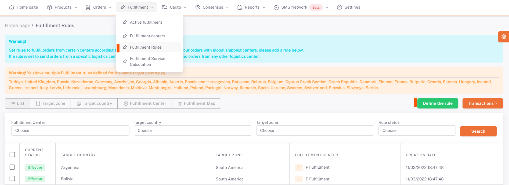
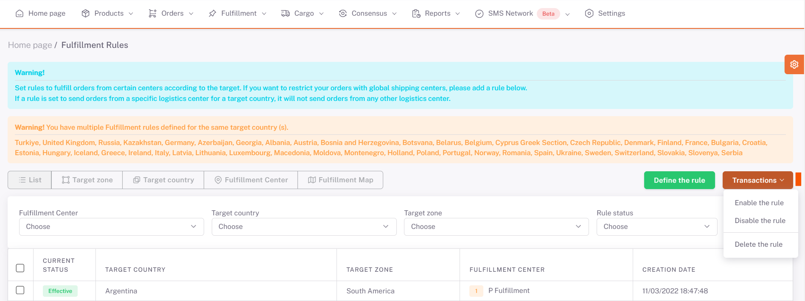
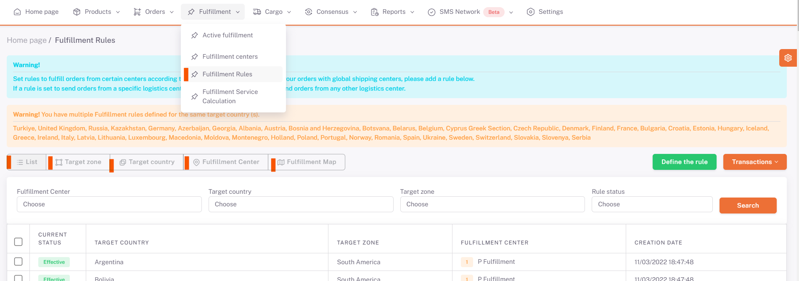

# Fulfillment Rules

In case of working with more than one **fulfillment**, **rule definitions** are made for these fulfillments.

The purpose of defining a rule is to automatically select the warehouse where the orders coming from certain regions will be sent, and to ensure that they are exited from that warehouse.

***To define a rule***,

On the **Shopiverse panel > Fulfillment > Fulfillment Rules** screen, the “**Define Rule**” button is pressed.

**Rule definition** is made by filling in the fields on the **opening screen**.

**Fulfilment Center** is selected as the warehouse for which the rule definition is to be made.

*Target Country* and *Target Region* are selected.

**Rule Status** is selected as “Enabled” or “Disabled”.

The priority order is also filled and saved.

If the **rule definition** is completed and its status is selected as “**Active**”, when there is an order from the target region and country, the order will be forwarded to the selected fulfillment center based on the order of priority.

If the status is selected as “**Disabled**”, it means that when there is an order from the target region and country, it is not requested to be directed to the selected fulfillment center.

The rules defined in the page opened by clicking the "***Target Region***" button are listed in groups according to the target regions.

The rules defined on the page opened by clicking the “***Target Country***” button are listed in groups according to the target countries.

The rules defined on the page opened by clicking the “***Fulfillment Center***” button are listed as grouped according to fulfillment centers.

The rules defined on the page opened by clicking the “***Fulfillment Map***” button are displayed on the map.

By selecting Fulfillment, the rules for which regions of this fulfillment are defined are displayed on the map.

