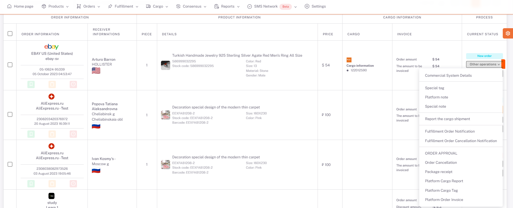

# Orders

There are transactions made specifically for the order.

Options are opened by pressing the **Other Transactions** button.

In order to add a *private label* to the order, it is saved by selecting from the previously defined labels on the screen opened by pressing the **Private Label** button.

In order to add a *platform note* to the order, it is saved by filling in the Platform Note field on the screen opened by clicking the **Platform Note** button.

In order to add a *special note* to the order, it is saved by filling in the Special Note field on the screen opened by clicking the **Special Note** button.

In order to *notify* the order to the courier, the required fields are filled on the screen opened by clicking the **Notify Cargo Shipment** button.

The order can be sent *to the buyer himself or to a fulfillment*.

The order is saved by selecting **delivery place**.

 

To *confirm* the order, the **Order Confirm** button is pressed.

To *cancel* the order, click the **Order Cancel** button.

To download the *package slip* from the platform, the **Package Receipt** button is pressed.

In case the cargo goes with a platform agreement, the **Notify Platform Cargo** button is pressed to *report the order to the platform*.

After the cargo notification is made to the platform, the **Platform Cargo Label** button is pressed to *download* the cargo label coming from the platform.