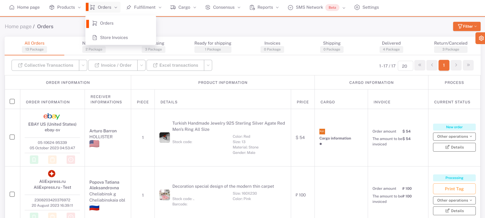
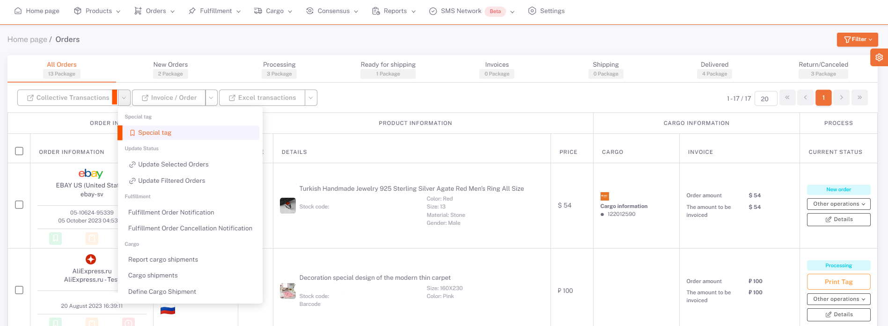
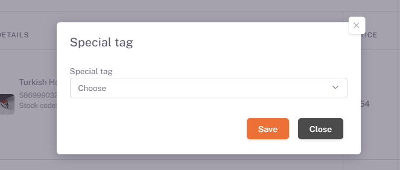
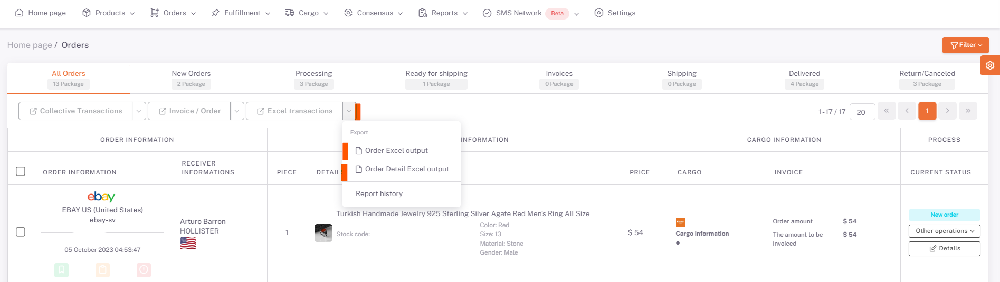

# Orders

All orders are available on the **ShopiVerse Panel > Orders** page.

:::caution
In order for **orders from platforms** to be reflected on the ShopiVerse panel, the business plan must first be run.
From the **ShopiVerse Panel > Settings > Business Plan** screen, the "Bring Market Order" business plan listed under the relevant platform is run.
This business plan can be automated and orders can be drawn regularly.
:::

 

Orders can be collectively defined as **[Private Label](/docs/dashboard/dashboard-tutorial/settings/order-private-label)**. Orders that want to add a private label are selected.

On the screen opened by pressing the **Batch Operations > Special Label** button, it is selected from the previously defined labels and saved.

## Excel Operations

**Print of orders** can be exported as excel. By clicking the **Excel Transactions > Order Excel Output** button, the export of the orders is started.

By clicking the **Excel Transactions > Order Detail Excel Printout** button, the export is started with the product items included in the orders.

The status of excel is displayed on the **Report History** page. Order excel is available for download when it goes to "*Completed*" status.

Excel is downloaded by clicking the **Result File** button.