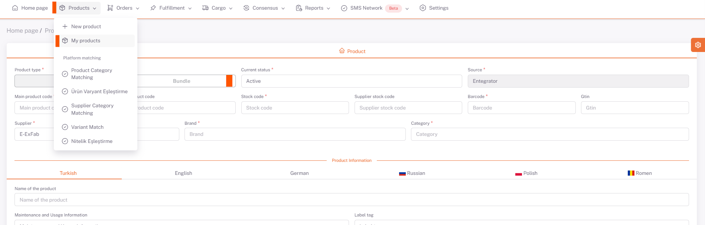
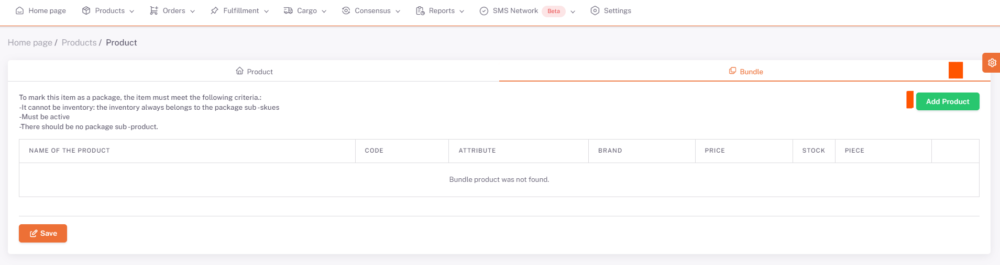
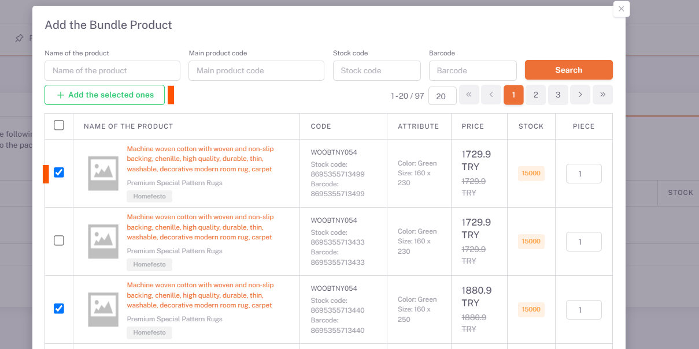

# Product Loading via Panel

## Adding a Bundle Product

By clicking the **ShopiVerse Panel > Products > New Product** button, the product information is filled in and viewed on the screen opened.

**Standard** or **Package** products can be added. Bundle To define the Product, move the Product Type as “**Package**”.

Fill in the product information. **Supplier Name, Main Product Code, Stock Code, Barcode, Brand and Category fields** are mandatory fields and must be filled in.

- **Main Product Code** is the group code of the product.

- **Product Code** is the color based group code.

- **Stock Code** is the stock code information of the product. It should be singular.

- **Barcode** is the barcode information of the product. It should be singular.

- **Supplier Stock Code** is the unique code of the supplier.

- In the *Supplier Name* field, **Settings > Suppliers** the description of the song is listed. To benefit from the supplier desired to be used.

- **Brand** is the brand information of the product.

- **Category** is the producer category breakdown.

- Product Name, Short Description, Description, Care and Usage Information, Label fields language guidance.

- In case more than one tag is desired to be added, it should be defined by separating it with commas.

- To provide product color and size information.

- Sets product price details, currency and stock quantities.

- It tells the size information of the product and the package.

- Pictures of the product guide as a file or picture path.

- If there is a video of the picture, it guides as a video path.

- It is transferred to the product by pressing the “**Save**” button.

“***Package***” tab opens to add **Package** product.

:::Attention
By clicking the “**Add Product**” button, the products that can be added in the package are listed on the screen. These products are standard products. Adding a package No other package product can be added.
:::

The products to be added to the bundle are allowed, for each sub-product, the Quantity field is placed in the number field to be added to the bundle.

Foods are added by clicking the "**Add Selected" button.

**Products to be removed from the package** can be deleted by pressing the **Delete** button.

After selecting the products purchased from the consumers in the bundle, the package product definition is completed by clicking the "**Save**" button.

