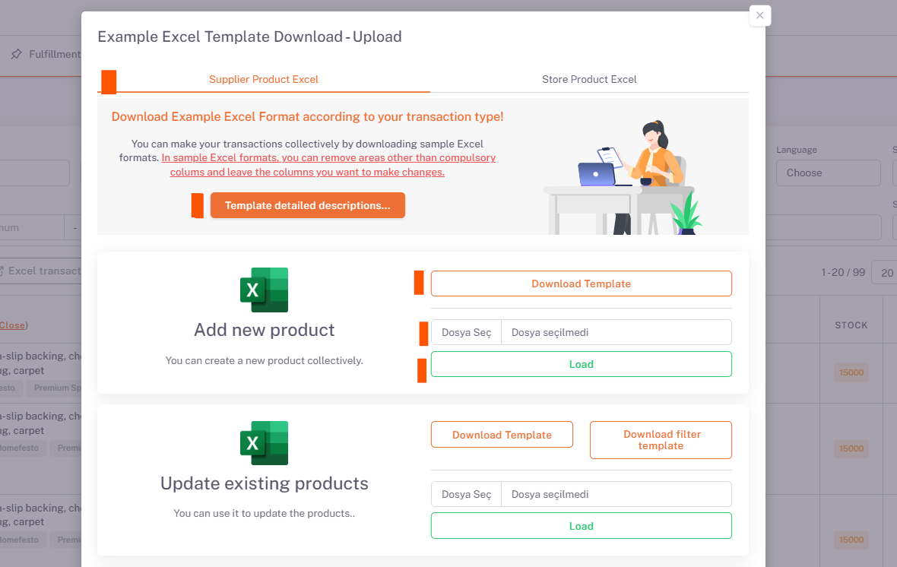
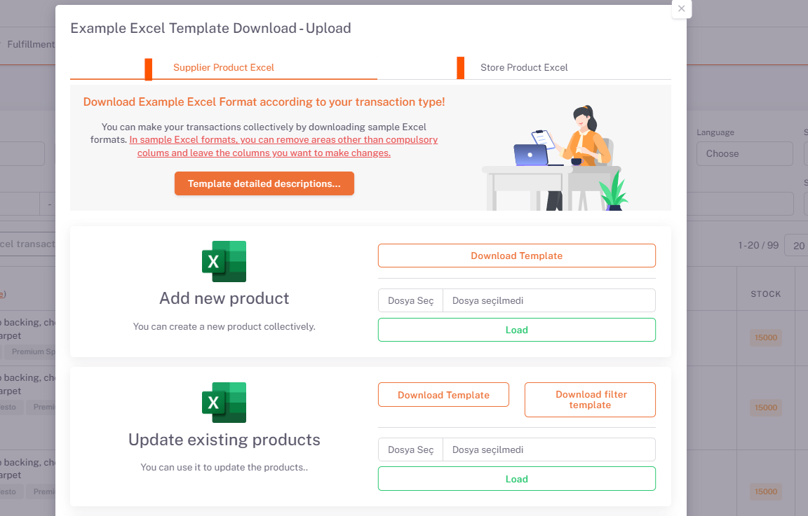

# My Products
All products are listed on the **ShopiVerse Panel > Products > My Products** screen. **Product filtering, publishing, adding, deleting and editing** operations are done on this screen.

## Downloading Products

**Products** can be pulled from a source or imported manually via excel.

### Uploading Products with Excel

The supplier definition is made on the **ShopiVerse Panel > Settings > [Suppliers](/docs/dashboard/dashboard-tutorial/settings/suppliers/new-supplier)** screen. Here "**Supplier Name**" will be written in excel.

**ShopiVerse Panel > Products > My Products > Excel Transactions** button is pressed.

The current template is downloaded by clicking the **Add New Product > Download Template** button.

The filled excel is selected from the "**Add New Product**" field by clicking the "**Choose File**" button and loaded by clicking the "**Upload**" button.

:::caution
Columns shown in color on the template are **required fields** and must be filled.
More detailed information is available in the excel downloaded from the "**Template Detailed Descriptions**" button.
:::

Excel's status is displayed on the **ShopiVerse Panel > Reports > Report History** page. When the status is "***Completed***", the import of products is finished.

## Excel Operations

There are two tabs on the page that opens when the **Products > My Products > Excel Transactions** button is clicked.

The processes in the **Supplier Product Excel** tab are used to make changes to the supplier product information.

The transactions in the **Store Product Excel** tab are used to make changes to the product information added to the store. The changes made here do not affect the supplier information, but the store product information is the priority when sending products to the platforms.

:::caution
In case the store product information is empty, the supplier product information is taken as the basis.
:::

