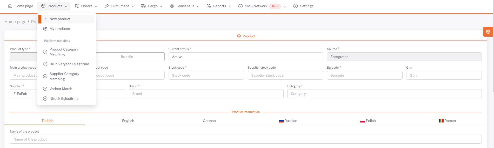

# Adding a Product

## Product Installation via Source

The supplier definition is made on the **ShopiVerse Panel > Settings > [Suppliers](/docs/dashboard/dashboard-tutorial/settings/suppliers/new-supplier)** screen.

After the supplier identification is completed, it is necessary to run the business plan to transfer the products to ShopiVerse.

The "*Supplier Product Transfer*" business plan on the **ShopiVerse Panel > Settings > Business Plan** page is run.

When the business plan is completed, the import of products is finished.

## Product Loading via Panel

### Adding Standard Items

By clicking the **ShopiVerse Panel > Products > New Product** button, the product information is filled and saved on the screen opened.

**Standard** or **Bundle** products can be added. To define a Standard Product, the Product Type is selected as “**Standard**”.

Product information is filled. **Supplier Name, Main Product Code, Stock Code, Barcode, Brand and Category fields** are mandatory fields and must be filled in.

- **Main Product Code** is the group code of the product.

- **Product Code** is the color based group code.

- **Stock Code** is the stock code information of the product. It should be singular.

- **Barcode** is the barcode information of the product. It should be singular.

- **Supplier Stock Code** is the unique code of the supplier.

- In the *Supplier Name* field, the suppliers defined in the **Settings > Suppliers** screen are listed. The supplier to be used is selected.

- **Brand** is the brand information of the product.

- **Category** is the category breakdown of the product.

- Product Name, Short Description, Description, Maintenance and Usage Information, Label fields can be defined based on language.

- In case more than one tag is wanted to be added, it should be defined by separating it with commas.

- Color and size attribute information of the product is defined.

- The price details, currency and stock amount of the product are defined.

- Dimension information of the product and the package is defined.

- Pictures of the product can be defined as file or picture path.

- If there is a video of the picture, it can be defined as a video path.

- The product is saved by clicking the “**Save**” button.