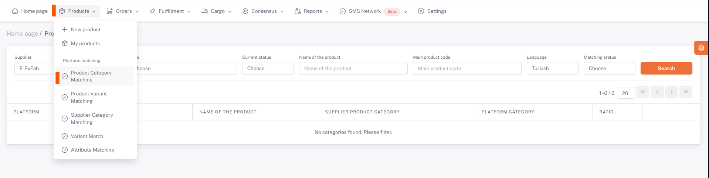
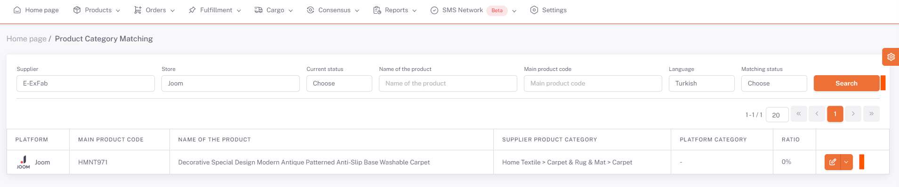

# Product Category Matching

**ShopiVerse Panel > Products > Platform Matching> Product Category Matching** screens are displayed.

For each product for which category matching is desired, **details** must be entered and matching processes must be done.

On the screen opened by pressing the **Detail** button, the **platform category** to be matched is selected from the "**Platform Category**" field.

If there are property fields that need to be filled, they are filled and saved.

The category matching of the product has been completed.
 
:::caution
If **Supplier Category Matching** has been made before for the product, it will now be deemed invalid and will be based on the **category** in the **Product Category Matching** process.
:::