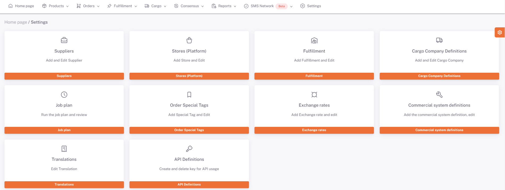

# API Definitions

In order for the data on the *Shopiverse Panel* to be retrieved with *Api*, you can provide Api permissions by specifying **Api Type and Authorized User** and creating **Api Key** on the **Shopiverse Panel > Settings > Api Definitions** tab.
You can get information about permissions and tests on **[Our API page](/docs/api)**.

