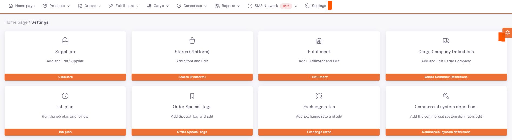
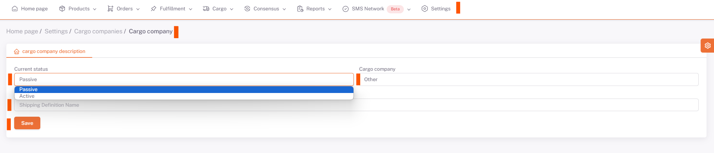

# Cargo Company Definitions

To define a new cargo company, go to the **Home Page > Settings > Cargo Company Definitions** screen.

**"New"** By pressing the *button*, the new cargo company information is entered and the registration process is performed.

Status information is selected depending on whether the **cargo company** is **active** or **inactive**.

The *Desired Cargo Company* is selected and the *name* desired to be given to the defined courier company* is filled in the **Cargo Description Name** field and saved.

:::caution
On the screen that opens, in the **Api Definition** tab, the information that will provide **cargo company and ShopiVerse integration** is defined.
**[Cargo Integrations](/docs/category/kargo-entegrasyon)** You can define API from page.
:::