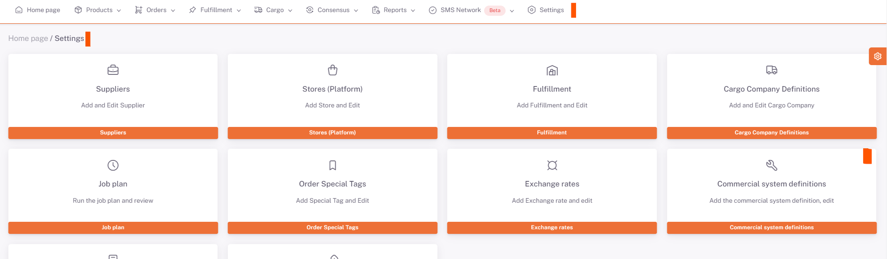
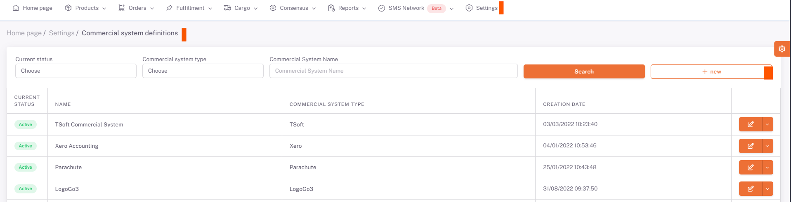
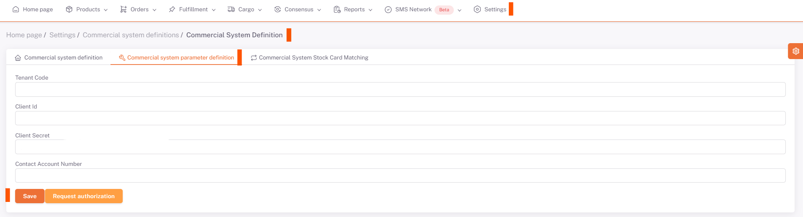

# Commercial System Definitions

To define a new commercial system, go to the **ShopiVerse Panel > Settings > Commercial System Definitions** screen.

By clicking the "**New**" button, the new commercial system information is entered on the page opened and the registration process is performed.

**Status information** ***Active/Passive*** is selected. **Commercial System Type** is selected as ***Commercial System name***. In the Name field, the name to be given to the commercial system is filled in and saved.

On the screen that opens, in the "**Commercial System Parameter Definition**" tab, there are fields that must be filled for the integration of **ShopiVerse and the Commercial System you will work with**.

:::caution
You can find these Fields in [MyCommercialSite Integrations](/docs/category/commercial-system-integration).
:::