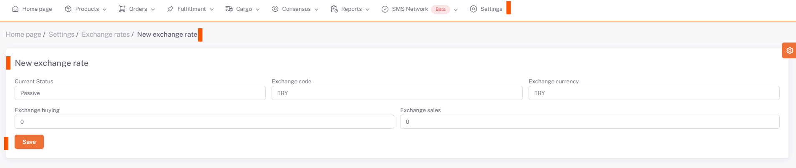

# Exchange

On the **ShopiVerse Panel > Settings > Exchange Rates** screen, the current exchange rates drawn from the Central Bank of Turkey are listed.

Here customers have **custom currency definition** feature.

By clicking the "**New Exchange Rate**" button, a rate definition is made manually on the screen opened.

- **Status** is selected as active or passive.

- **Currency Code**, the code of the converted currency unit is selected.

    - **Currency Code** is defined as the code of the currency being converted.

- **Foreign Currency**, the currency to be converted is selected.

- **Foreign Currency** is defined as the currency to be converted.

- The desired purchase price is defined in the **Currency Buying** field.

- The desired sales price is defined and recorded in the **Foreign Exchange Sales** field.

- **Manual currency definition** process has been completed.