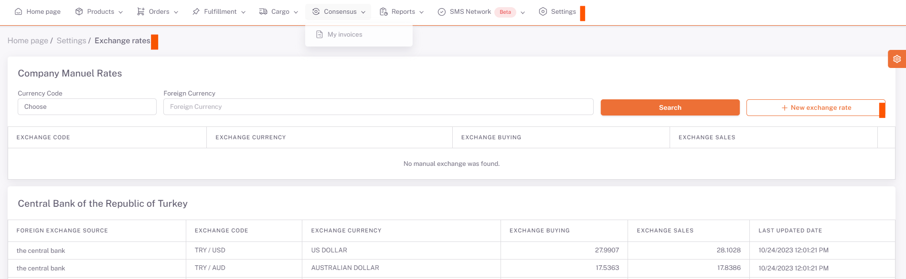

# Döviz Kurları

**ShopiVerse Panel > Ayarlar > Döviz Kurları** ekranında Türkiye Merkez Bankası'ndan güncel olarak çekilen kurlar listelenmektedir.

Burada müşterilerin **kendine özel kur tanımlama** özelliği vardır.

"**Yeni Döviz Kuru**" butonuna basılarak açılan ekranda manuel olarak bir kur tanımlaması yapılır. 

- **Durumu** aktif veya pasif olarak seçilir. 

- **Döviz Kodu**, dönüştürülen döviz biriminin kodu seçilir. 

   - **Döviz Kodu**, dönüştürülen para biriminin kodu olarak tanımlanır. 

- **Döviz Para Birim**i, dönüştürülmek istenen para birimi seçilir. 

- **Döviz Para Birim**i, dönüştürülmek istenen para birimi olarak tanımlanır. 

- **Döviz Alış** alanına istenen alış fiyatı tanımlanır. 

- **Döviz Satış** alanına istenen satış fiyatı tanımlanır ve kaydedilir. 

- **Manuel kur tanımlama** işlemi tamamlanmıştır. 

