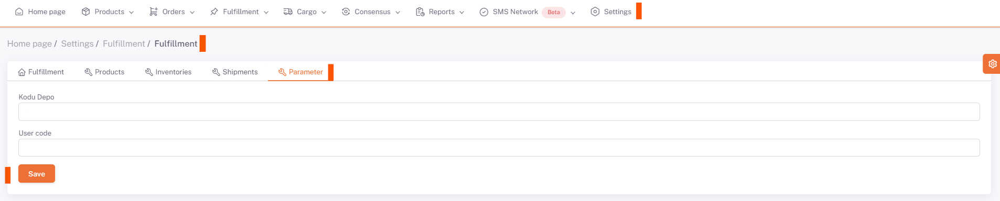
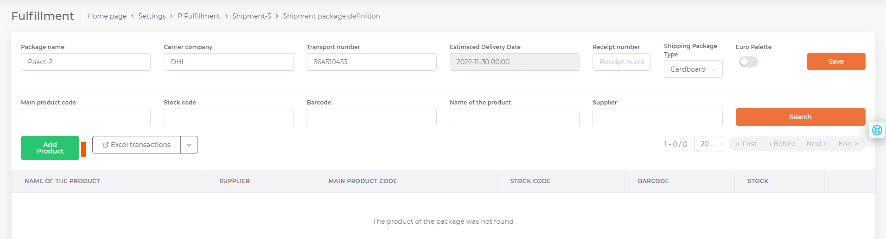
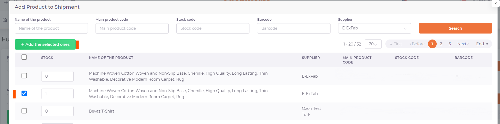

# Fulfillment Shipment

## parameter

It is the tab where **User Code and Warehouse Code** information is found.

The definitions of this information are made by ShopiVerse.

## Shipments

After the *product shipments* are completed, the physical shipment of the products is carried out.

The "New" button is pressed and the Status and Shipment Name are defined and saved on the opened screen.

### Package Description

After the shipment is saved, the packages are defined in the shipment.

Click the "New Package" button.

The name given to the created package is defined in the **Package name** field.

In the **Carrier Company** field, the name of the cargo company to be used is defined.

**Transport Number, Estimated Delivery Date, Receipt Number information** are defined and saved by selecting **Cargo Package Type**.

### Adding Products

Then, the products are added to the package by entering the **package detail** created.

"**Add Product**" button is pressed.

The products to be added to the package are selected, the stock value to be sent for each product is entered and the process is completed by clicking the "**Add Selected" button.

Adding the products to the shipment has been completed.

To **notify the shipment** to the warehouse, it is necessary to run the business plans.

"**Notify Warehouse Shipment**" business plan is run from the **ShopiVerse Panel > Settings > Work Plan** screen.
When the business plan is in the "**Completed**" status, the shipments to the warehouse have been completed, and the product can now be physically shipped.

If you want to check the status of the shipment after physically sending the shipment, first the "**Warehouse Shipment Status**" business plan is run from the **ShopiVerse Panel > Settings > Work Plan** screen.

:::caution
When the work plan is completed, the Shipment Status should be checked in the Shipping tab.
:::