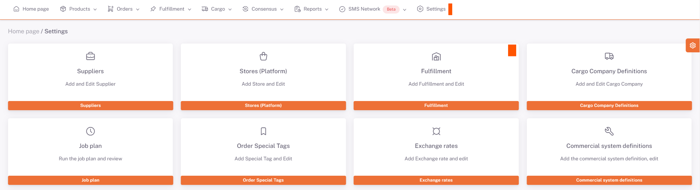
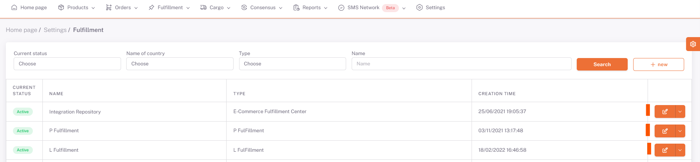
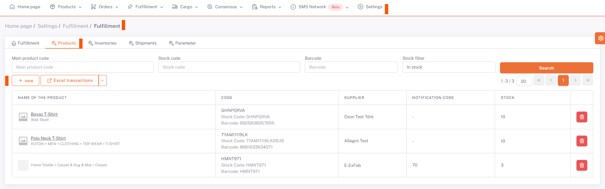
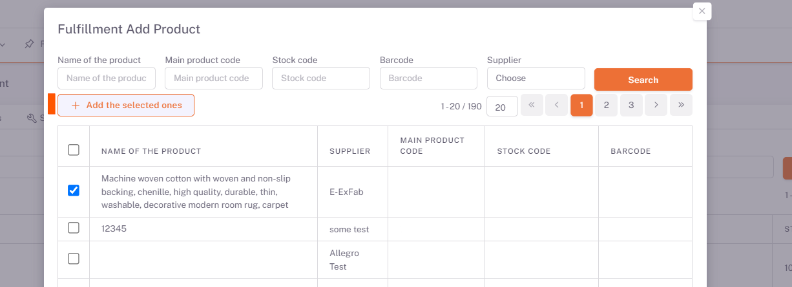

# Fulfillment

When it is desired to work with **Fulfillment**, this request is first sent to **ShopiVerse** and **user definitions** are made after the warehouse agreement processes. According to ***Storage and user information***, fulfillment definition is also made in the panel by ShopiVerse.

To see the defined Fulfillment warehouses, go to the **ShopiVerse Panel > Settings > Fulfillment** screen.

Some tabs are opened when entering **Repository details**.

## Fulfillment

It is the tab with general information about the warehouse.

The definitions of this information are made by ShopiVerse.

## Products

Before the shipment of the products is made, the product information to be shipped to the warehouse must be sent.

In the Products tab, the products to be sent to the warehouse are selected.

Click on the "**New**" button and select the products listed on the "**Add Fulfillment Product**" screen to be sent to the warehouse and click on the "**Add Selected" button.

Products that are not wanted to be sent to the warehouse can be deleted by pressing the delete button.

After the selection of the products, business plans must be run in order to send the information to the warehouse. If the Notification Code field is empty, it means that the product has not been reported to the warehouse yet.

 

"***Send Warehouse Product***" business plan is run from the **ShopiVerse Panel > Settings > Business Plan** screen.

When the work plan is in the "**Completed**" status, the shipments to the warehouse are completed and the Notification Code information is received.

## Inventories

Inventory counts are made by the warehouse when the products physically arrive at the warehouse.

In order to reflect these inventory details to ShopiVerse, the "**Warehouse Product Stock Transfer**" business plan is run from the **ShopiVerse Panel > Settings > Business Plan** screen.

When the work plan is completed, the inventory details going to the warehouse are updated in the Inventory tab.