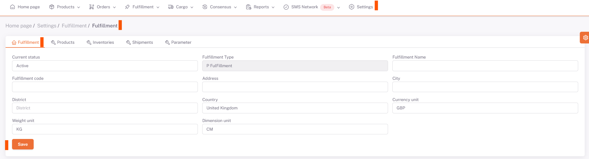

# Fulfillment

**Fulfillment** ile çalışmak istenildiğinde öncelikle bu talep **ShopiVerse**’e iletilir ve depo anlaşma süreçlerinden sonra **kullanıcı tanımlama**ları yapılır. ***Depo ve kullanıcı bilgileri***ne göre ShopiVerse tarafından panelde de fulfillment tanımı yapılır. 

Tanımlanan Fulfillment deposularını görmek için **ShopiVerse Panel > Ayarlar > Fulfillment** ekranına gidilir. 

 

 

**Depolar detayı**na girildiğinde burada bazı sekmeler açılmaktadır.   

## Fulfillment 

Depoya ait genel bilgilerin bulunduğu sekmedir. 

 

Bu bilgilerin tanımlamaları ShopiVerse tarafından yapılır. 

## Ürünler 

Ürünlerin sevkiyat işlemi yapılmadan önce depoya sevkiyat edilecek ürün bilgilerinin gönderilmesi gereklidir. 

 

Ürünler sekmesinde depoya gönderilecek ürünler seçilir. 

 

"**Yeni**" butonuna basılır ve açılan "**Fulfillment Ürün Ekle**" ekranında listelenen ürünlerden depoya gönderilmek istenenler seçilerek "**Seçili Olanları Ekle**" butonuna basılır.

Depoya gönderilmek istenmeyen ürünler silme butonuna basılarak silinebilir. 

Ürünlerin seçimi yapıldıktan sonra bilgilerin depoya gönderilebilmesi için iş planlarının çalıştırılması gereklidir. Bildirim Kodu alanının boş olması henüz o ürünün depoya bildirilmediği anlamına gelir. 

 

**ShopiVerse Panel > Ayarlar > İş Planı** ekranından "***Depo Ürün Gönder***" iş planı çalıştırılır.

İş planı "**Tamamlandı**" durumuna geçtiğinde depoya gönderimler tamamlanmıştır ve Bildirim Kodu bilgileri gelmiştir. 

## Envanterler 

Ürünler depoya fiziksel olarak vardığında depo tarafından envanter sayımları yapılır. 

 

Bu envanter detaylarının ShopiVerse'e yansıması için **ShopiVerse Panel > Ayarlar > İş Planı** ekranından "**Depo Ürün Stok Aktar**" iş planı çalıştırılır.

İş planı tamamlandığında Envanter sekmesinde depoya giden envanter detayları güncellenmiş durumdadır.  