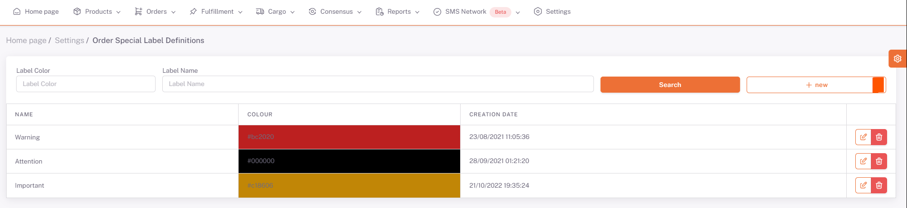

# Order Private Label

**Private labels** are labels defined to provide information about orders.

To define a *new order custom label*, go to the **ShopiVerse Panel > Settings > Order Special Label Definitions** screens and click on the "**New**" button.

On the screen that opens, *the name to be given to the label* is defined in the **Name** field, and *the color to be given to the label* is defined in the **Color** field.

The *Description* field is also filled and saved.