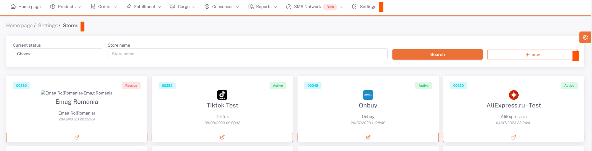
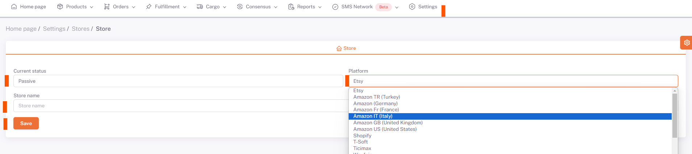

# Adding New Store

## Settings

In the **ShopiVerse** user panel, we add the information of the store we want to add with the *Add Button* in **Settings > Stores**.

## Add Store

We fill in the **Store Status (Active / Inactive)** , **The platform name we want to publish and the name of our store** in the **Store adding panel**.
Then we save our store with the **save button**.

