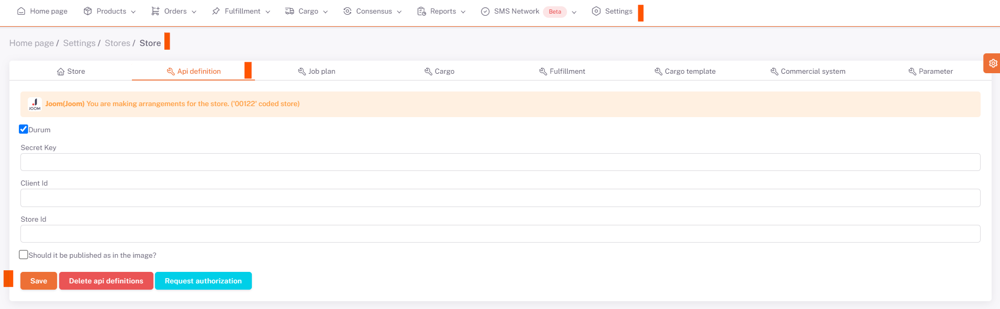
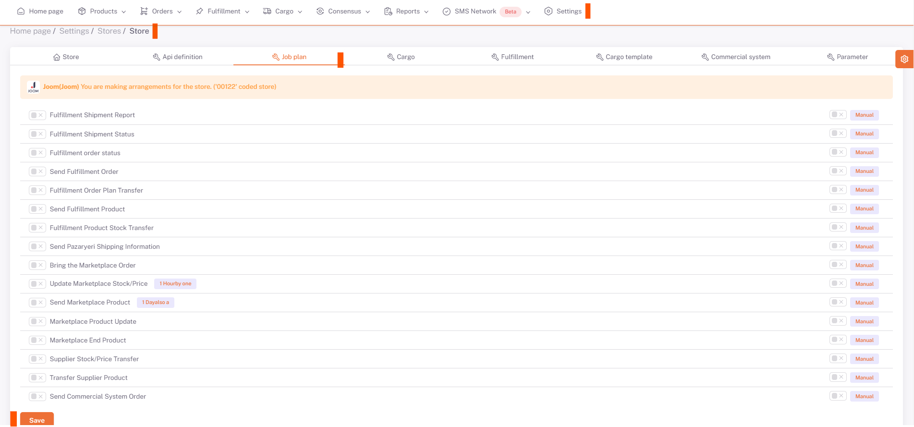
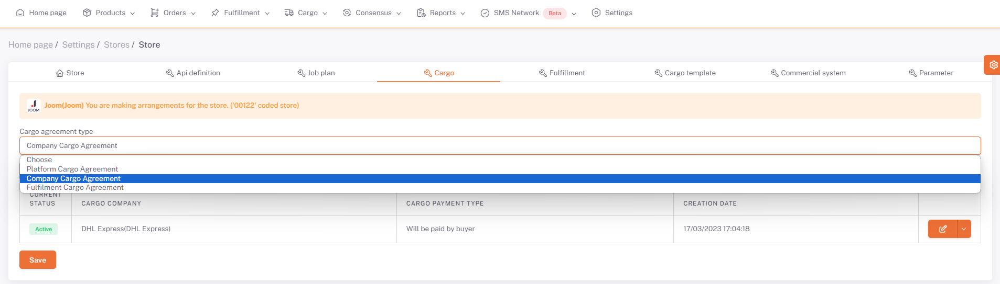

# Panel Introduction

## Api Definition

Marketplace API definitions are made in [API Integrations in Marketplaces](/docs/category/marketplaces). And the necessary places are filled. The definitions that will connect the ShopiVerse panel and the stores are made here.

## Business plan

Jobs to be done in [Business Plans](/docs/dashboard/dashboard-tutorial/settings/business-plan/) are set to **Active/Passive** and **Manual/Auto** and business plans are listed in the store. Work plans are tasks that need to be triggered to keep data flowing between the ShopiVerse panel and platforms.
In this tab, there are business plans defined for the relevant store.

:::caution
In case it is set manually, it must be triggered specifically for the work plan to run.
In case it is set to automatic, the work plan runs automatically at certain time intervals.
:::

## Cargo

Store-specific cargo definition is made here.
The cargo agreement type is selected and saved.

