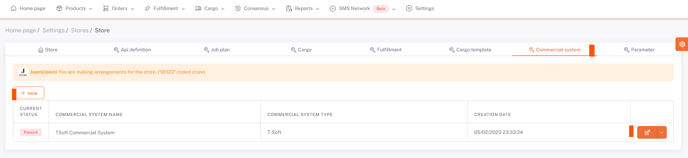

# Commercial System

Store-specific commercial system definition is made here.

On the screen opened by pressing the "**New**" button, the status and commercial system information are selected and saved.

Commercial Site information can be edited with the "**Edit**" button.