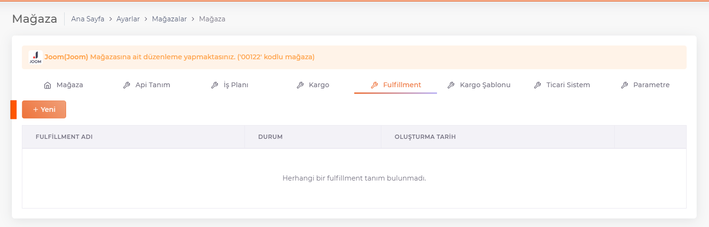
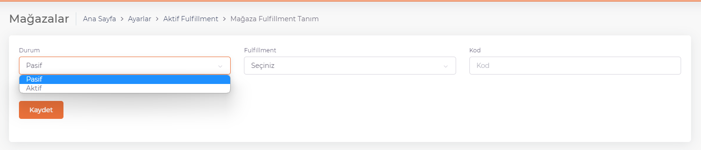

# Fulfillment

The definition of store-specific **fulfillment** is made here.

On the screen opened by pressing the "**New**" button, the status and **fulfillment information** are selected and saved.

The status is selected as **Active/Passive**, the **Fulfillment** system is selected, the **Code** we have defined is written and saved.